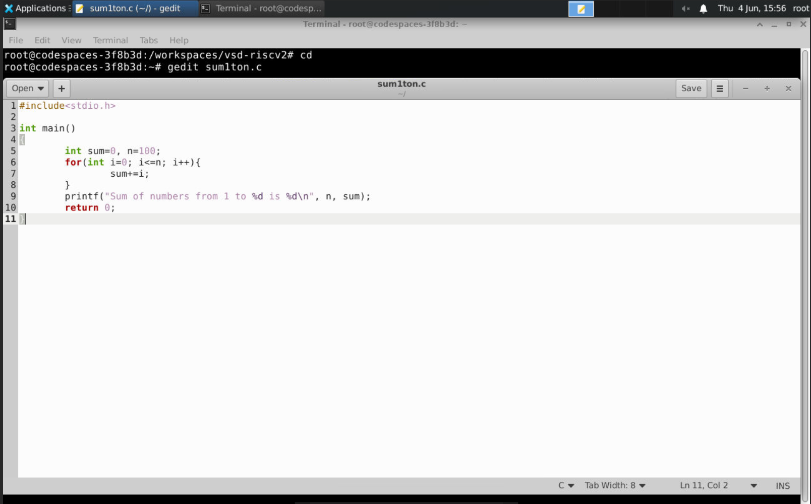
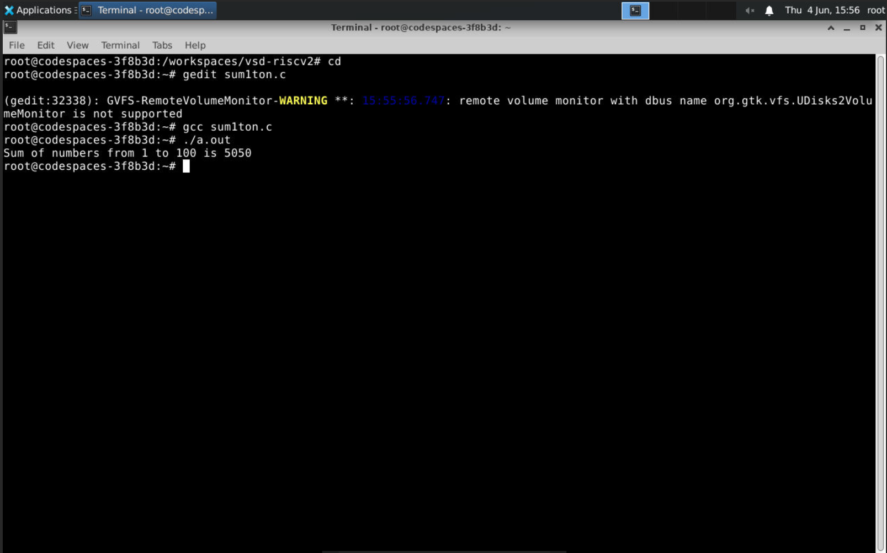
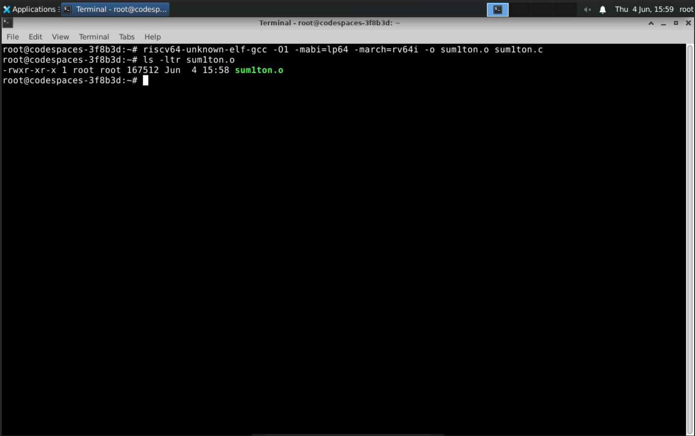
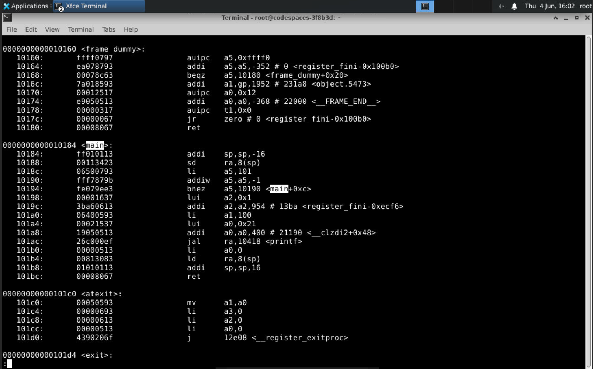
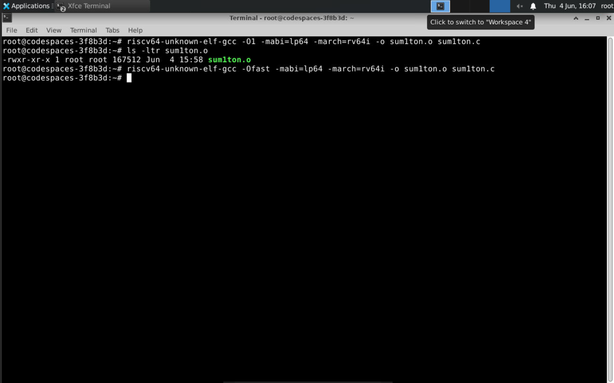
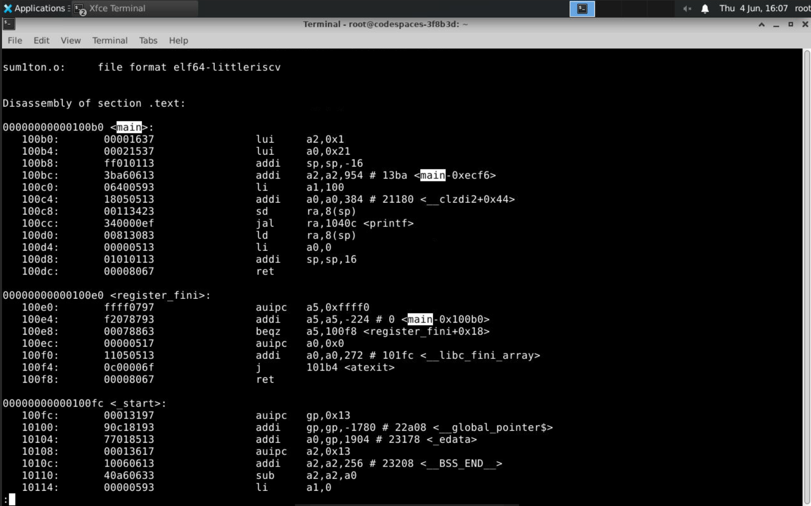

# Task 1: Introduction to the RISC-V Compilation and Optimization Process

## Objective

The objective of this task is to gain familiarity with the Linux-based development environment and understand the complete compilation flow from a high-level C program to RISC-V machine instructions. The task includes creating a simple C program, compiling and executing it using the GNU Compiler Collection (GCC), cross-compiling the same program using the RISC-V GCC toolchain, generating assembly code through disassembly, and analyzing the impact of different compiler optimization levels on the generated RISC-V instructions.


---

## Step 1: Open the Terminal

Open the Linux terminal and navigate to the home directory.

```bash
cd
```

---

## Step 2: Create a New C Source File

Create a new C source file named `sum1ton.c` using the Gedit text editor.

```bash
gedit sum1ton.c
```

A new editor window opens where the C program can be written.

### Screenshot



---

## Step 3: Write the C Program

Enter the following code into the editor and save the file.

```c
#include<stdio.h>

int main()
{
    int sum=0, n=100;
    for(int i=0; i<=n; i++){
        sum+=i;
    }
    printf("Sum of numbers from 1 to %d is %d\n", n, sum);
    return 0;
}
```

The program calculates the sum of all natural numbers from 1 to 100 using a `for` loop and displays the result on the terminal.

---

## Step 4: Compile the Program

Return to the terminal and compile the source file using GCC.

```bash
gcc sum1ton.c
```

If the compilation is successful, no error messages are displayed and an executable file named `a.out` is generated.

---

## Step 5: Execute the Program

Run the generated executable.

```bash
./a.out
```

The terminal displays the result of the program execution.

Expected Output:

```text
Sum of numbers from 1 to 100 is 5050
```

### Screenshot



---

## Step 6: Compile the Program Using the RISC-V GCC Compiler with `-O1` Optimization

To generate RISC-V machine code, the program is compiled using the RISC-V cross-compiler.

```bash
riscv64-unknown-elf-gcc -O1 -mabi=lp64 -march=rv64i -o sum1ton.o sum1ton.c
```

### Understanding the Command

* `riscv64-unknown-elf-gcc`

  * GNU cross-compiler targeting the RISC-V architecture.
  * Generates executable code for a RISC-V processor instead of the host machine.

* `-O1`

  * Enables Level-1 compiler optimizations.
  * Performs basic optimizations to improve code efficiency while maintaining relatively fast compilation.

* `-mabi=lp64`

  * Specifies the Application Binary Interface (ABI).
  * `lp64` means:

    * `long` = 64 bits
    * pointers = 64 bits
    * integer registers are 64 bits wide

* `-march=rv64i`

  * Specifies the target RISC-V architecture.
  * `rv64` indicates a 64-bit RISC-V processor.
  * `i` indicates the base integer instruction set.

* `-o sum1ton.o`

  * Specifies the name of the output file.

* `sum1ton.c`

  * Input source file.

After successful compilation, the generated file can be verified using:

```bash
ls -ltr sum1ton.o
```

### Screenshot



---

## Step 7: Generate and Analyze the RISC-V Assembly Code

The generated RISC-V executable is disassembled using the GNU Object Dump utility.

```bash
riscv64-unknown-elf-objdump -d sum1ton.o | less
```

### Understanding the Command

* `riscv64-unknown-elf-objdump`

  * Utility used to inspect compiled RISC-V binaries.

* `-d`

  * Disassembles executable sections.
  * Converts machine code back into readable assembly instructions.

* `sum1ton.o`

  * Input file to be disassembled.

* `|`

  * Pipe operator.
  * Sends the output of one command as input to another command.

* `less`

  * Terminal pager used for viewing large outputs one page at a time.

---

## Step 8: Locate the `main()` Function in the Disassembly

Inside the disassembly output, search for the label:

```text
<main>
```

The assembly instructions corresponding to the C program are located under this label.

### Screenshot



---

## Step 9: Analyze the Instructions Generated with `-O1`

From the disassembly of the `main()` function:

### Starting Address

```text
0x10184
```

### Ending Address

```text
0x101bc
```

### Number of Instructions

```text
15 Instructions
```

### Instruction Length

The difference between consecutive instruction addresses is:

```text
0x4 bytes
```

Therefore, each instruction occupies:

```text
4 Bytes = 32 Bits
```

The total code size occupied by the instructions in `main()` is:

```text
0x101bc - 0x10184 + 4 = 60 Bytes
```

which corresponds to:

```text
15 × 4 = 60 Bytes
```

---

## Step 10: Compile the Program Using `-Ofast` Optimization

Next, the same source code is compiled using aggressive compiler optimizations.

```bash
riscv64-unknown-elf-gcc -Ofast -mabi=lp64 -march=rv64i -o sum1ton.o sum1ton.c
```

### Understanding `-Ofast`

`-Ofast` enables all optimizations included in `-O3` and additional aggressive optimizations that prioritize execution speed over strict standards compliance.

Examples include:

* More aggressive code simplification
* Loop optimizations
* Function inlining
* Removal of unnecessary computations
* Better utilization of processor resources

### Screenshot



---

## Step 11: Generate the Assembly Code for the `-Ofast` Build

Again, disassemble the generated binary.

```bash
riscv64-unknown-elf-objdump -d sum1ton.o | less
```

Search for:

```text
<main>
```

and inspect the instructions generated by the compiler.

### Screenshot



---

## Step 12: Analyze the Instructions Generated with `-Ofast`

From the disassembly of the `main()` function:

### Starting Address

```text
0x100b0
```

### Ending Address

```text
0x100dc
```

### Number of Instructions

```text
12 Instructions
```

### Instruction Length

The difference between consecutive instruction addresses is:

```text
0x4 bytes
```

Therefore, each instruction occupies:

```text
4 Bytes = 32 Bits
```

### Total Code Size

The total memory occupied by the instructions in the `main()` function is:

```text
0x100dc - 0x100b0 + 4 = 48 Bytes
```

which corresponds to:

```text
12 × 4 = 48 Bytes
```

---

## Observation

Comparing the `-O1` and the `-Ofast` builds:

| Optimization Level | Start Address | End Address | Instructions | Code Size |
| ------------------ | ------------- | ----------- | ------------ | --------- |
| O1                 | 0x10184       | 0x101bc     | 15           | 60 Bytes  |
| Ofast              | 0x100b0       | 0x100dc     | 12           | 48 Bytes  |

The compiler optimization performed by `-Ofast` reduced the instruction count from **15 to 12 instructions** and reduced the code size from **60 Bytes to 48 Bytes**.

This happened because the compiler recognized that the result of the loop can be determined during compilation and generated a more efficient implementation of the program.

---

## Key Learnings

* Learned how to create, edit, compile, and execute C programs in a Linux environment.
* Understood the basic software development workflow involving source code creation, compilation, and execution.
* Gained hands-on experience with the GNU Compiler Collection (GCC).
* Learned the concept of cross-compilation and how programs can be compiled for a target architecture different from the host system.
* Understood the purpose of the RISC-V GCC toolchain and its role in generating RISC-V executable binaries.
* Learned the significance of compiler options such as `-O1`, `-Ofast`, `-mabi=lp64`, and `-march=rv64i`.
* Generated and analyzed RISC-V assembly code using the GNU Object Dump utility (`objdump`).
* Learned how machine instructions are represented in assembly language and how they correspond to high-level C code.
* Studied the structure of the `main()` function in RISC-V assembly.
* Understood instruction addressing, instruction size, and memory layout within a compiled program.
* Compared the assembly generated using different optimization levels and observed the effect of compiler optimizations on code size and instruction count.
* Observed that aggressive compiler optimizations can significantly reduce the number of instructions by eliminating redundant operations and simplifying program execution.

---

## Conclusion

The task was successfully completed by developing a C program, compiling it for both the native environment and the RISC-V architecture, and analyzing the generated assembly code. The use of the `objdump` utility provided valuable insight into how high-level C statements are translated into RISC-V instructions.

A comparison between the `-O1` and `-Ofast` optimization levels demonstrated the effectiveness of compiler optimizations. The `-O1` build generated 15 instructions for the `main()` function, whereas the `-Ofast` build reduced the instruction count to 12 instructions and decreased the overall code size. This reduction was achieved through more aggressive optimization techniques performed by the compiler.

Overall, the task provided a strong foundation in C programming, Linux development tools, RISC-V cross-compilation, assembly-level analysis, and compiler optimization techniques, which will be essential for subsequent tasks in the RISC-V FPGA IP Development Internship.


---
