# Task 2: SPIKE Simulation and Observation with -O1 and -Ofast

## Objective

The objective of this task is to understand the execution and debugging of RISC-V programs using the SPIKE simulator. The task involves verifying the correctness of RISC-V executables generated using different compiler optimization levels, observing program execution through simulation, and analyzing the effect of individual assembly instructions on processor registers. Additionally, an AI/ML-inspired C application implementing a simple artificial neuron with ReLU activation will be developed, compiled using the RISC-V GCC toolchain, and executed on the SPIKE simulator to gain hands-on experience with the complete RISC-V software development flow.

---

## Overview

This task is divided into two parts:

### Part 1: Verification and Debugging of the Task 1 Program

The C program developed in Task 1 is compiled using RISC-V GCC with both **-O1** and **-Ofast** optimization levels and executed on the SPIKE simulator. The generated assembly code is analyzed using `objdump`, and instruction-by-instruction execution is observed in SPIKE debug mode to understand the behavior of RISC-V instructions and register updates. Selected instructions are further examined to understand their encoding, functionality, and impact on processor state.

### Part 2: Development and Simulation of an AI/ML-Based C Application

A simple AI/ML application based on an artificial neuron with ReLU activation is developed in C. The program performs weighted input processing, bias addition, and activation computation, which are fundamental operations used in neural networks. The application is compiled using the RISC-V GCC toolchain and executed on the SPIKE simulator. The generated assembly code and processor behavior are analyzed to study how basic AI/ML computations are implemented and executed on a RISC-V processor.

---

## Why Perform SPIKE Simulation?

Before moving to RTL design and hardware implementation, it is important to verify that the RISC-V executable generated by the compiler behaves exactly as intended.

In chip modelling, the output produced by the compiled RISC-V program must match the output produced by the original C model (specification). This process is known as **functional verification**, where the software model acts as the reference specification.

### Functional Verification Flow

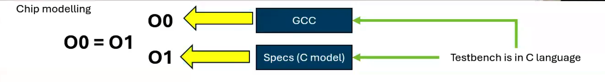

### Explanation

- The original C program acts as the **reference specification (golden model)**.
- GCC compilation produces an executable based on the C source code.
- The generated RISC-V executable is then executed using the **SPIKE RISC-V simulator**.
- The outputs obtained from the simulator are compared with the outputs obtained from the original C program.
- If both outputs match, it confirms that the compiled RISC-V program correctly implements the intended functionality.

As illustrated above, the output generated by the GCC-compiled program (**O0**) and the output generated by the RISC-V compiled program (**O1**) should be identical. This verifies that the functionality of the program remains unchanged after compilation for the RISC-V architecture.

In this task, C programs are executed using:

- Native GCC compilation and execution
- RISC-V GCC compilation with **-O1** optimization
- RISC-V GCC compilation with **-Ofast** optimization
- SPIKE simulation of the generated RISC-V executables

The outputs obtained from all executions are compared to verify functional correctness before proceeding to instruction-level analysis and debugging using the SPIKE debugger.

---

# Part 1: Verifying RISC-V Simulation Using SPIKE and Observing Instruction Execution

### Objective

The objective of this experiment is to verify that the RISC-V executable generated using the RISC-V GCC compiler produces the same output as the original C program compiled using the native GCC compiler. The generated RISC-V executable is executed on the SPIKE RISC-V simulator using both **-O1** and **-Ofast** optimization levels. The assembly code generated in the previous task is then debugged instruction-by-instruction using SPIKE's debug mode to observe changes in register values and understand the execution of RISC-V instructions.

---

## Step 1: Execute the Program Using Native GCC Compiler

The C program developed in Task 1 is first compiled using the host GCC compiler and executed to obtain the reference output.

### Command Used

```bash
gcc sum1ton.c
./a.out
```

### Explanation

* `gcc` is the native GNU C Compiler available on the host system.
* `sum1ton.c` is the source file containing the program.
* `./a.out` executes the generated executable.

### Output

```text
Sum of numbers from 1 to 100 is 5050
```

### Screenshot

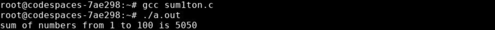

This output serves as the reference result for validating the RISC-V implementation.

---

## Step 2: Compile and Simulate the Program Using RISC-V GCC (-O1)

The program is compiled for the RISC-V architecture using the **-O1** optimization level and then executed on the SPIKE simulator.

### Command Used

```bash
riscv64-unknown-elf-gcc -O1 -mabi=lp64 -march=rv64i -o sum1ton.o sum1ton.c
```

### Explanation of Command

* `riscv64-unknown-elf-gcc` : RISC-V cross compiler.
* `-O1` : Enables basic optimization.
* `-mabi=lp64` : Uses the LP64 ABI where long integers and pointers are 64-bit.
* `-march=rv64i` : Targets the RV64I base integer instruction set.
* `-o sum1ton.o` : Specifies the output executable file.
* `sum1ton.c` : Source program.

### Execute on SPIKE

```bash
spike pk sum1ton.o
```

### Explanation

* `spike` : Official RISC-V ISA simulator.
* `pk` : Proxy Kernel used to provide minimal runtime support.
* `sum1ton.o` : Compiled RISC-V executable.

### Output

```text
Sum of numbers from 1 to 100 is 5050
```

### Observation

The output produced by the SPIKE simulator exactly matches the output produced by the native GCC executable, confirming correct compilation and execution of the RISC-V binary.

### Screenshot

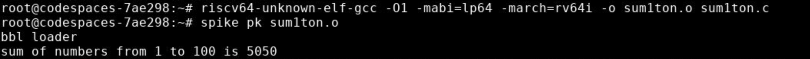

---

## Step 3: Compile and Simulate the Program Using RISC-V GCC (-Ofast)

The same program is compiled using the aggressive optimization level **-Ofast**.

### Command Used

```bash
riscv64-unknown-elf-gcc -Ofast -mabi=lp64 -march=rv64i -o sum1ton.o sum1ton.c
```

### Explanation

* `-Ofast` enables more aggressive optimizations than `-O1`.
* The compiler prioritizes execution speed and may restructure the generated machine code significantly.

### Execute on SPIKE

```bash
spike pk sum1ton.o
```

### Output

```text
Sum of numbers from 1 to 100 is 5050
```

### Observation

Even though the assembly code generated using **-Ofast** differs from the **-O1** version, the final output remains identical. This demonstrates that compiler optimizations can alter implementation details without affecting program functionality.

### Screenshot

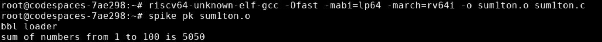

---

## Step 4: Open the Disassembly of the Optimized Program

Before entering debug mode, the generated assembly code is examined using `objdump`.

### Command Used

```bash
riscv64-unknown-elf-objdump -d sum1ton.o | less
```

### Explanation

* `objdump` disassembles machine code into assembly instructions.
* `-d` requests disassembly of executable sections.
* `less` allows scrolling through the output.

The `<main>` function generated using **-Ofast** is located and its instructions are identified for detailed observation during simulation.

### Screenshot

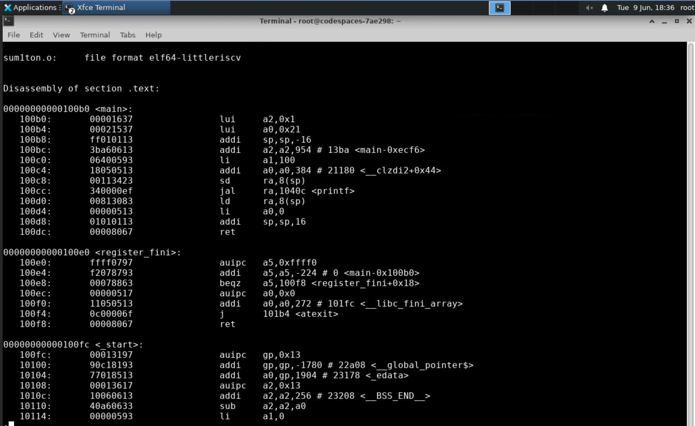

---

## Step 5: Start SPIKE Debugger

To observe instruction execution step-by-step, SPIKE is launched in debug mode.

### Command Used

```bash
spike -d pk sum1ton.o
```

### Explanation

* `-d` enables interactive debugging mode.
* Execution pauses and waits for user commands.

---

## Step 6: Run Execution Until the Beginning of main()

The debugger is instructed to continue execution until the program counter reaches the first instruction of the `main()` function.

### Command Used

```bash
until pc 0 100b0
```

### Explanation

* `until` executes instructions automatically until a specified condition is met.
* `pc` refers to the Program Counter.
* `0` indicates Core 0.
* `100b0` is the starting address of the `main()` function obtained from the disassembly.

Execution now pauses at the first instruction inside `main()`.

---
## Step 7: Observe the First Instruction (LUI)

### Instruction

```assembly
lui a2,0x1
```

### Understanding the LUI Instruction

**LUI (Load Upper Immediate)** is a U-type instruction used to load a 20-bit immediate value into the upper 20 bits of a register while setting the lower 12 bits to zero.

General format:

```assembly
lui rd, immediate
```

Where:

- `rd` = destination register
- `immediate` = 20-bit constant value

The instruction format is shown below:

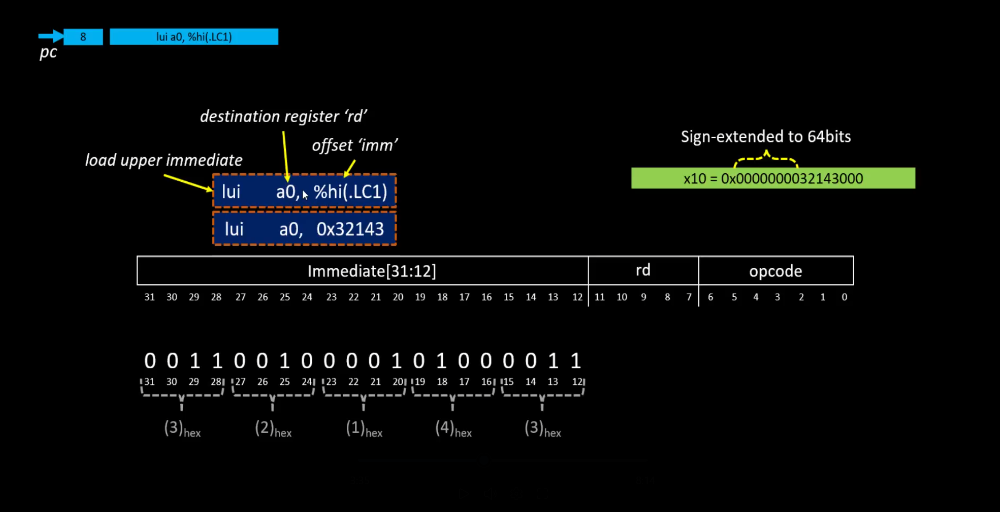

### Register Verification

Before execution:

```bash
reg 0 a2
```

Output:

```text
0x0000000000000000
```

Execute one instruction and check the register again:

```bash
reg 0 a2
```

Output:

```text
0x0000000000001000
```

### Calculation

The immediate value loaded is `0x1`.

LUI shifts this value left by 12 bits before storing it into the destination register:

```text
0x1 << 12 = 0x1000
```

Therefore:

```text
a2 = 0x0000000000001000
```

### Observation

The value stored in register `a2` after execution exactly matches the expected result. This confirms that the LUI instruction correctly loads the upper immediate value into the destination register.

### Screenshot

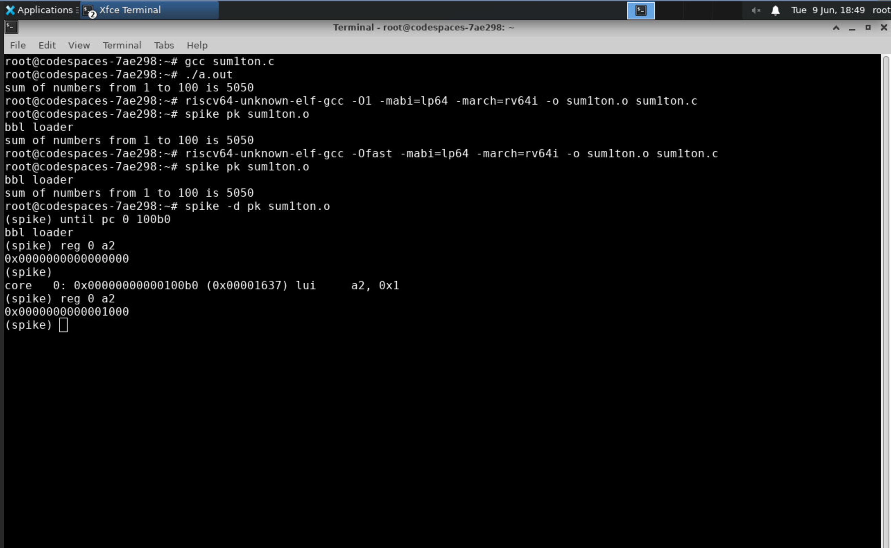

---

## Step 8: Observe the Second Instruction (LUI)

### Instruction

```assembly
lui a0,0x21
```

### Register Verification

Before execution:

```bash
reg 0 a0
```

Output:

```text
0x0000000000000001
```

Execute the instruction and check the register again:

```bash
reg 0 a0
```

Output:

```text
0x0000000000021000
```

### Calculation

The immediate value loaded is `0x21`.

LUI shifts this value left by 12 bits before storing it into the destination register:

```text
0x21 << 12 = 0x21000
```

Therefore:

```text
a0 = 0x0000000000021000
```

### Observation

The value observed in register `a0` matches the expected result, verifying the correct operation of the second LUI instruction.

### Screenshot

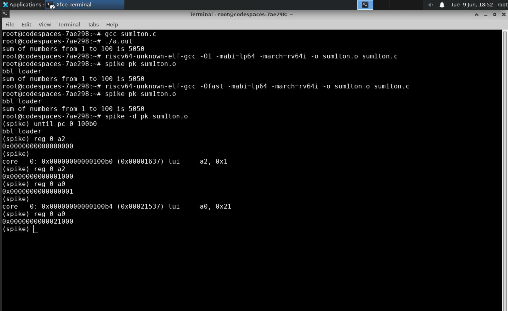

---

## Step 9: Observe the Third Instruction (ADDI)

### Instruction

```assembly
addi sp, sp, -16
```

### Understanding the ADDI Instruction

**ADDI (Add Immediate)** is an I-type instruction that adds a constant value (immediate) to a source register and stores the result in the destination register.

General format:

```assembly
addi rd, rs1, immediate
```

Where:

- `rd` = destination register
- `rs1` = source register
- `immediate` = constant value to be added

The instruction format is shown below:

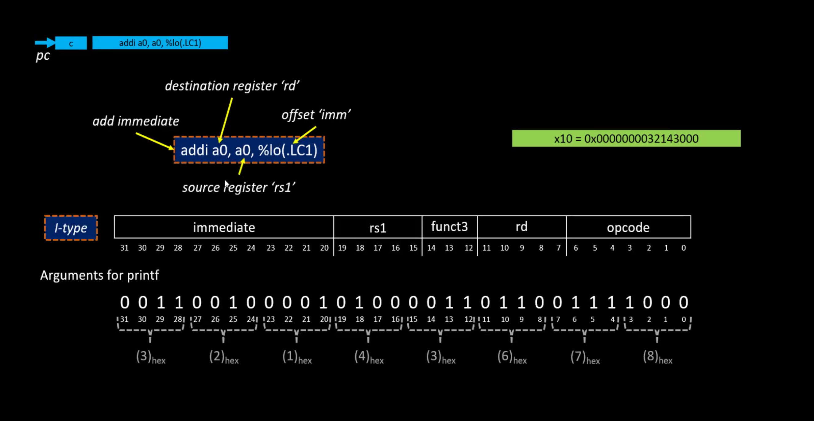

### Register Verification

Before execution:

```bash
reg 0 sp
```

Output:

```text
0x0000007f7e9b50
```

Execute the instruction and check the register again:

```bash
reg 0 sp
```

Output:

```text
0x0000007f7e9b40
```

### Calculation

The instruction performs:

```text
sp = sp + (-16)
```

Substituting the register value:

```text
0x7f7e9b50 - 0x10 = 0x7f7e9b40
```

### Observation

The stack pointer decreases by 16 bytes, allocating stack space for the function. This is a common operation performed at the beginning of a function call to create a stack frame.

The change in the stack pointer observed in the debugger exactly matches the expected result of the ADDI instruction, confirming correct execution.

### Screenshot

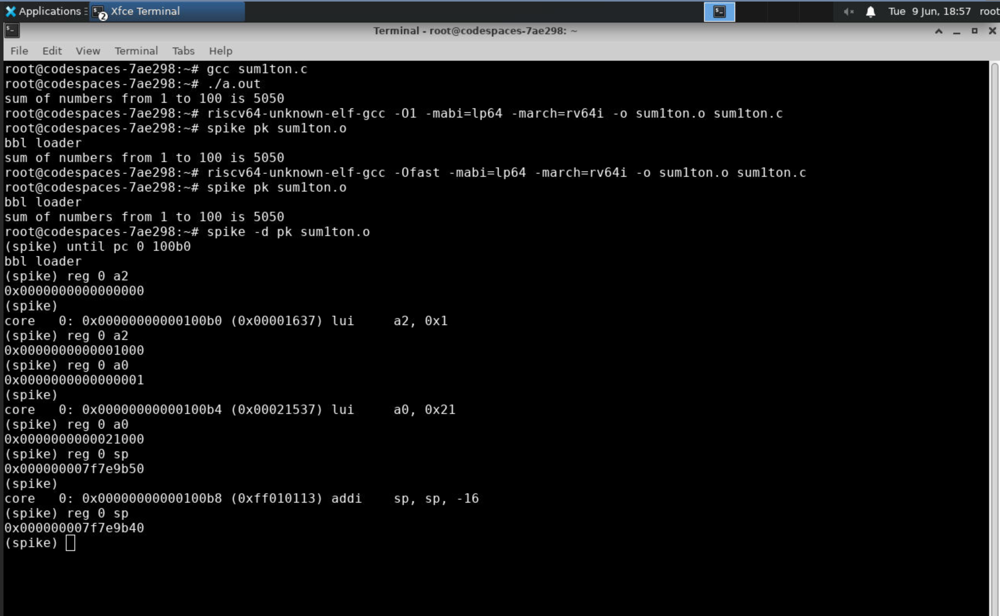

---

## Observation

1. Both **-O1** and **-Ofast** compiled binaries produce the same output as the native GCC executable.
2. SPIKE successfully simulates execution of RISC-V programs.
3. The debugger allows observation of instruction execution at the register level.
4. `LUI` loads upper immediate values into registers.
5. `ADDI` performs arithmetic operations using an immediate constant.
6. Register values can be monitored after every instruction to verify program behavior.

---

## Conclusion

The RISC-V executable generated using both **-O1** and **-Ofast** optimization levels was successfully executed on the SPIKE simulator and produced the same output as the original GCC-compiled program. Using SPIKE's debug mode, instruction-by-instruction execution was observed and register modifications caused by the `LUI` and `ADDI` instructions were verified. This experiment demonstrated the correctness of the RISC-V compilation flow and provided insight into low-level instruction execution within the RISC-V architecture.

---
---

# Part 2: Development and Simulation of an AI/ML-Based C Application

## Objective

To develop a simple Artificial Intelligence / Machine Learning (AI/ML) application in C, compile it using the RISC-V GCC toolchain, execute it on the SPIKE simulator, and analyze the generated assembly code to understand how basic neural network computations are implemented and executed on a RISC-V processor.

---

## Introduction

Artificial Neural Networks (ANNs) form the foundation of many modern AI/ML applications. At the core of every neural network is an artificial neuron, which performs a weighted sum of input values followed by an activation function.

In this experiment, a simple artificial neuron with a ReLU (Rectified Linear Unit) activation function is implemented in C. The program is compiled for the RISC-V architecture using the RISC-V GCC compiler and executed using the SPIKE simulator. The generated assembly code is then analyzed to observe how AI/ML computations are translated into RISC-V instructions.

---

## Artificial Neuron Model

The output of a neuron is calculated using:

\[
y = (x_1w_1 + x_2w_2 + x_3w_3) + bias
\]

where:

- \(x_1, x_2, x_3\) are the input values
- \(w_1, w_2, w_3\) are the corresponding weights
- **bias** is a constant value added to the weighted sum

After calculating the weighted sum, the ReLU activation function is applied:

\[
ReLU(y)=max(0,y)
\]

This means:

- If \(y > 0\), output = \(y\)
- If \(y < 0\), output = \(0\)

---

## Program Implementation

The following C program implements a simple artificial neuron with three inputs and a ReLU activation function.

```c
#include <stdio.h>

int main()
{
    int inputs[3] = {2, 3, 1};
    int weights[3] = {4, 5, 2};

    int bias = -20;
    int output = bias;

    for(int i=0; i<3; i++){
        output += inputs[i] * weights[i];
    }

    if(output < 0)
        output = 0;

    printf("Neuron Output = %d\n", output);

    return 0;
}
```

---

## Step 1: Create the Source File

Create a new source file and enter the program code.

```bash
gedit neuron.c
```

Save the file after entering the code.

### Screenshot


---

## Step 2: Compile and Execute Using Native GCC

Compile the program using the standard GCC compiler.

```bash
gcc neuron.c
```

Execute the generated program.

```bash
./a.out
```

### Expected Output

```text
Neuron Output = 5
```

The weighted sum is calculated as:

```text
(2×4) + (3×5) + (1×2) - 20

= 8 + 15 + 2 - 20

= 5
```

Since the output is positive, the ReLU activation function does not modify the result.

### Screenshot


---

## Step 3: Compile Using RISC-V GCC

Compile the program for the RISC-V architecture using the **-O1** optimization level.

```bash
riscv64-unknown-elf-gcc -O1 -mabi=lp64 -march=rv64i -o neuron_O1.o neuron.c
```

### Command Explanation

- `riscv64-unknown-elf-gcc` → RISC-V cross compiler
- `-O1` → Enables moderate compiler optimizations
- `-mabi=lp64` → Uses LP64 ABI
- `-march=rv64i` → Targets the RV64I instruction set
- `-o neuron_O1.o` → Output executable file
- `neuron.c` → Source file

Compile the same program using the **-Ofast** optimization level.

```bash
riscv64-unknown-elf-gcc -Ofast -mabi=lp64 -march=rv64i -o neuron_Ofast.o neuron.c
```

### Screenshot


---

## Step 4: Execute on SPIKE Simulator

Run the executable generated with **-O1**.

```bash
spike pk neuron_O1.o
```

Run the executable generated with **-Ofast**.

```bash
spike pk neuron_Ofast.o
```

### Expected Output

```text
Neuron Output = 5
```

The output obtained through SPIKE should match the output obtained using native GCC execution.

### Screenshot


---

## Step 5: Generate and Analyze Assembly Code

The generated RISC-V executables were disassembled using `objdump` to observe the assembly instructions produced under different compiler optimization levels.

### Generate Assembly Code for the -O1 Executable

Execute the following command:

```bash
riscv64-unknown-elf-objdump -d neuron_O1.o | less
```

This command disassembles the executable and displays the generated RISC-V assembly code. The `main()` function was then located and analyzed.

### Analysis of the -O1 Version

**Start Address:** `0x10184`  
**End Address:** `0x101A8`

Since each RISC-V instruction occupies 4 bytes, the total number of instructions in the `main()` function can be calculated as:

\[
\frac{0x101A8 - 0x10184}{4} + 1 = 10
\]

**Instruction Count:** **10 Instructions**

### Screenshot

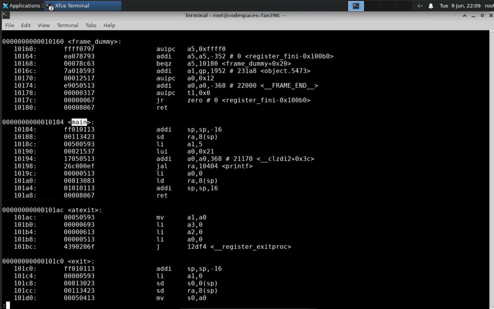

---

### Generate Assembly Code for the -Ofast Executable

Execute the following command:

```bash
riscv64-unknown-elf-objdump -d neuron_Ofast.o | less
```

This command generates the disassembled assembly code for the executable compiled using the `-Ofast` optimization level.

### Analysis of the -Ofast Version

**Start Address:** `0x100B0`  
**End Address:** `0x10140`

Since each RISC-V instruction occupies 4 bytes, the total number of instructions in the `main()` function can be calculated as:

\[
\frac{0x10140 - 0x100B0}{4} + 1 = 37
\]

**Instruction Count:** **37 Instructions**

### Screenshot

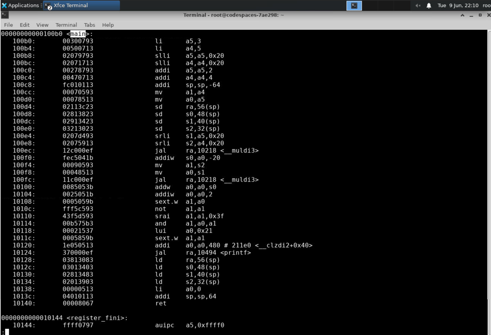

---

### Instruction Count Comparison

| Optimization Level | Start Address | End Address | Number of Instructions |
|-------------------|---------------|-------------|------------------------|
| -O1 | 0x10184 | 0x101A8 | 10 |
| -Ofast | 0x100B0 | 0x10140 | 37 |

---

### Observation

The assembly generated using the `-O1` optimization level contains **10 instructions**, whereas the assembly generated using the `-Ofast` optimization level contains **37 instructions**.

Although `-Ofast` is a more aggressive optimization level, it does not always generate fewer instructions. The compiler applies additional optimization techniques such as instruction scheduling, aggressive mathematical optimizations, constant propagation, and code transformations aimed at improving execution speed.

As a result, the compiler may generate a larger instruction sequence if it can improve runtime performance. Therefore, optimization effectiveness should be evaluated based on execution efficiency rather than instruction count alone.

In this application, the `-Ofast` version generated more instructions than the `-O1` version, indicating that the compiler performed additional transformations to optimize the execution of the neuron computation.

---

## Step 6: Debug Using SPIKE

Start SPIKE in debug mode.

```bash
spike -d pk neuron_Ofast.o
```

Run execution until the beginning of the main function.

```text
until pc 0 100b0
```

Observe register values.

```text
reg 0 a5
reg 0 a4
reg 0 sp
```

Execute instructions step-by-step and monitor changes in processor registers.

This allows verification of how arithmetic operations, memory accesses, and branch instructions contribute to the implementation of the neuron computation.

### Screenshot


---

## Observations

* The Artificial Neuron program was successfully compiled using both the native GCC compiler and the RISC-V GCC toolchain.
* The program produced the same output when executed using native GCC and the SPIKE RISC-V simulator, confirming the correctness of the generated RISC-V executable.
* The weighted sum of inputs and weights was correctly computed and processed through the ReLU activation function.
* Assembly code generated using different optimization levels showed significant differences in instruction count and code organization.
* The `-O1` optimized version generated 10 instructions within the `main()` function, whereas the `-Ofast` version generated 37 instructions.
* The increase in instruction count for the `-Ofast` build demonstrates that aggressive optimization does not necessarily reduce code size; instead, the compiler may introduce additional transformations to improve execution performance.
* Analysis of the disassembled code provided insight into how AI/ML computations are translated into RISC-V assembly instructions.

---

## Key Learnings

* Learned how basic Artificial Intelligence and Machine Learning computations can be implemented using the C programming language.
* Understood the working of an artificial neuron, including weighted inputs, bias addition, and ReLU activation.
* Learned how to compile AI/ML applications for the RISC-V architecture using the RISC-V GCC toolchain.
* Gained experience in executing RISC-V binaries on the SPIKE simulator.
* Learned how to generate and inspect assembly code using the GNU `objdump` utility.
* Understood the impact of compiler optimization levels on the generated assembly code.
* Learned how to compare assembly generated using `-O1` and `-Ofast` optimization levels.
* Gained insight into the relationship between high-level AI/ML algorithms and their low-level implementation on a RISC-V processor.
* Developed familiarity with the complete RISC-V software development workflow, including coding, compilation, simulation, and assembly analysis.

---

## Conclusion

In this experiment, a simple AI/ML-inspired application based on an artificial neuron with ReLU activation was successfully implemented, compiled, and executed on the RISC-V platform using the SPIKE simulator. The program produced the expected output and demonstrated the correctness of the generated RISC-V executable.

Assembly-level analysis revealed that different compiler optimization levels can significantly influence the structure and size of the generated machine code. While the `-Ofast` version produced a larger number of instructions than the `-O1` version for this application, both executables maintained identical functionality and produced the same output.

Overall, the experiment provided practical exposure to AI/ML computations, RISC-V cross-compilation, SPIKE-based simulation, and assembly code analysis, thereby strengthening the understanding of how high-level neural network operations are implemented and executed on RISC-V processors.
