# Task 3: Environment Setup & RISC-V Reference Bring-Up

## Objective

The objective of this task is to establish a complete RISC-V development environment, verify the reference RISC-V execution flow, and validate the VSDFPGA laboratory environment.

This task involves:

- Setting up the official GitHub Codespace environment
- Running and validating the provided RISC-V reference program
- Cloning and executing the VSDFPGA labs repository
- Preparing and validating a local Linux-based RISC-V development environment

The successful completion of these steps ensures readiness for future FPGA, IP integration, and SoC development tasks.

---

## Introduction

Before working on FPGA hardware, custom IP blocks, or SoC integration, it is important to establish a reliable software development environment and understand the complete RISC-V execution flow.

The official `vsd-riscv2` repository provides a preconfigured development environment through GitHub Codespaces, allowing participants to verify the RISC-V toolchain and simulator setup. Once the reference flow is validated, the `vsdfpga_labs` repository is used to execute additional laboratory exercises and verify multi-repository workflows.

To further prepare for future FPGA development tasks, a local Linux environment was also configured by installing and validating the RISC-V GCC Toolchain, Spike ISA Simulator, and RISC-V Proxy Kernel (PK).

This task serves as the foundation for all subsequent RISC-V, IP development, and FPGA integration activities.

---

## Environment Used

### Cloud Environment

- GitHub Codespaces
- VS Code Web Interface
- Preconfigured RISC-V Development Environment

### Local Environment

- Oracle VirtualBox
- Ubuntu Linux
- RISC-V GCC Toolchain (SiFive GCC 8.3.0)
- Spike ISA Simulator
- RISC-V Proxy Kernel (PK v1.0.0)

### Repositories Used

- https://github.com/vsdip/vsd-riscv2
- https://github.com/vsdip/vsdfpga_labs

---

# Step 1: GitHub Codespace Setup

## Accessing the Repository

The official `vsd-riscv2` repository was opened on GitHub. The repository contains a preconfigured development environment with the required RISC-V tools, libraries, and supporting infrastructure needed for the internship tasks.

### Screenshot

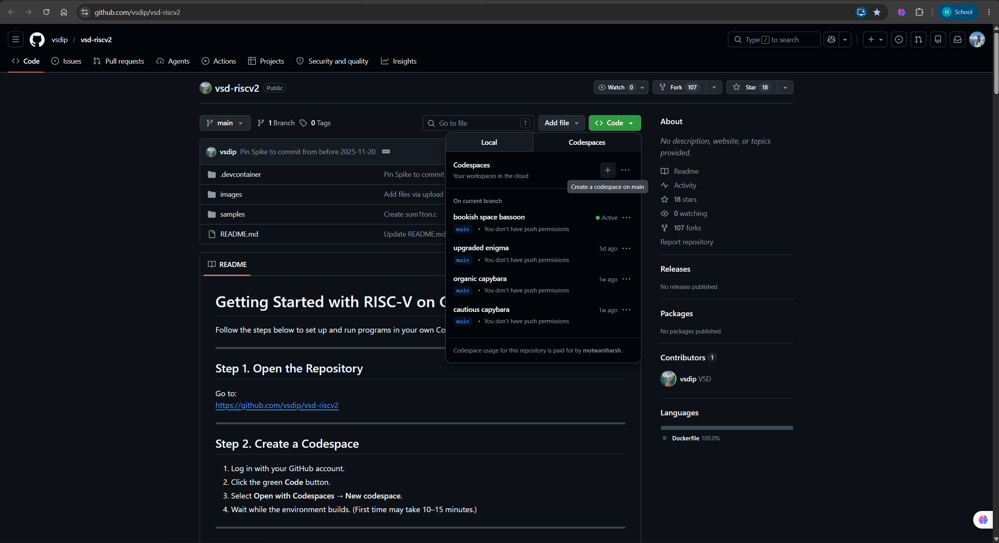

---

## Launching GitHub Codespace

A new GitHub Codespace was launched directly from the repository.

GitHub Codespaces automatically provisioned a cloud-based Linux development environment and configured the workspace using the repository's devcontainer settings.

After the initialization process completed, the workspace opened successfully without any startup or build errors.

The following checks confirmed that the environment was ready for use:

- Repository files were accessible.
- Terminal access was available.
- Development tools initialized successfully.
- Workspace configuration completed without errors.
- The environment was ready for RISC-V compilation and simulation tasks.

### Screenshot

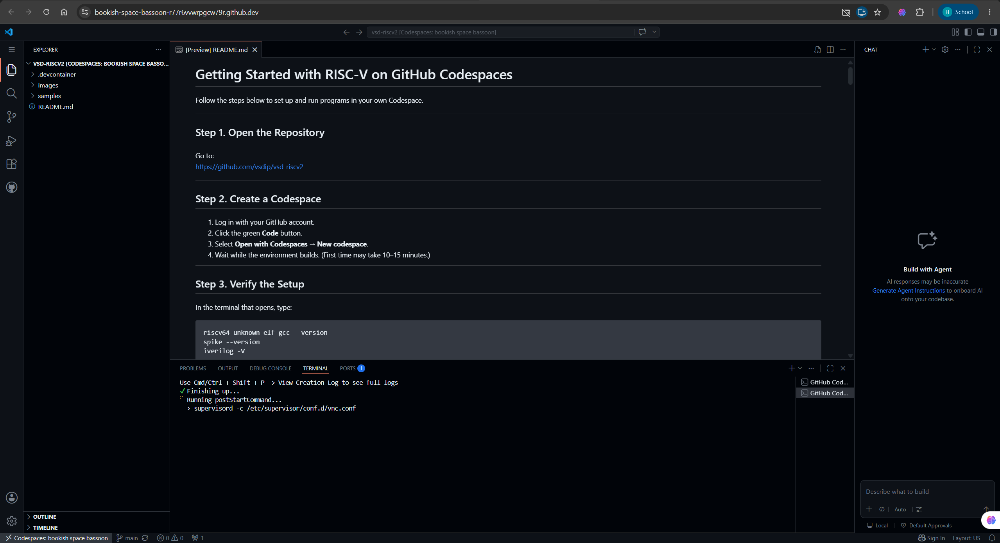

---

# Step 2: Verify RISC-V Reference Flow

The objective of this step is to verify that the RISC-V toolchain and simulation environment provided in the GitHub Codespace are functioning correctly. This is accomplished by compiling and executing a sample RISC-V program provided in the repository and observing its successful execution.

---

## Step 2.1: Open the Codespace Terminal

After the Codespace environment was initialized successfully, the integrated terminal was opened.

The terminal provides direct access to the pre-installed RISC-V GNU Toolchain, SPIKE ISA Simulator, and other development utilities required for the internship tasks.

### Screenshot

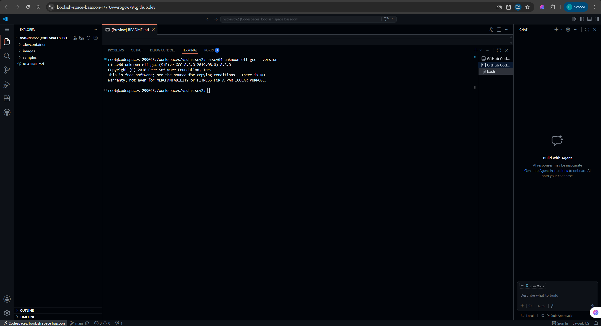

---

## Step 2.2: Navigate to the Samples Directory

The repository contains a collection of example programs inside the `samples` directory.

Navigate to the samples directory:

```bash
cd samples
```

Display the available files:

```bash
ls -ltr
```

The directory contains example programs and supporting files including:

* `sum1ton.c`
* `1ton_custom.c`
* `load.S`
* `Makefile`

---

## Step 2.3: Compile and Execute the Sample Program

The sample C program `sum1ton.c` calculates the sum of integers from 1 to n.

Compile the program using the RISC-V GNU Compiler:

```bash
riscv64-unknown-elf-gcc -o sum1ton.o sum1ton.c
```

Execute the generated RISC-V binary using the SPIKE ISA Simulator:

```bash
spike pk sum1ton.o
```

### Output

```text
Sum from 1 to 9 is 45
```

The successful execution confirms that:

* The RISC-V GCC toolchain is functioning correctly.
* The executable was generated successfully.
* The SPIKE simulator executed the program correctly.
* The development environment is properly configured.

### Screenshot

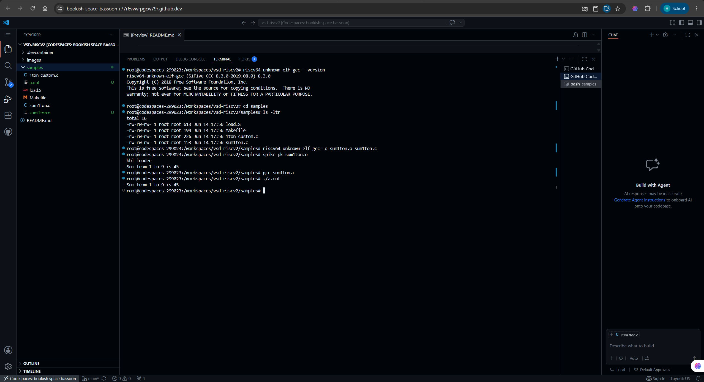

---

## Step 2.4: Modify and Re-Execute the Program

As recommended in the task, the sample program was modified by changing the value of `n` from `9` to `50`.

### Original Code

```c
int n = 9;
```

### Modified Code

```c
int n = 50;
```

Recompile the modified program:

```bash
riscv64-unknown-elf-gcc -o sum1ton_50.o sum1ton.c
```

Execute the program:

```bash
spike pk sum1ton_50.o
```

### Output

```text
Sum from 1 to 50 is 1275
```

The output matched the expected result, confirming successful compilation and execution of the modified program.

### Screenshot

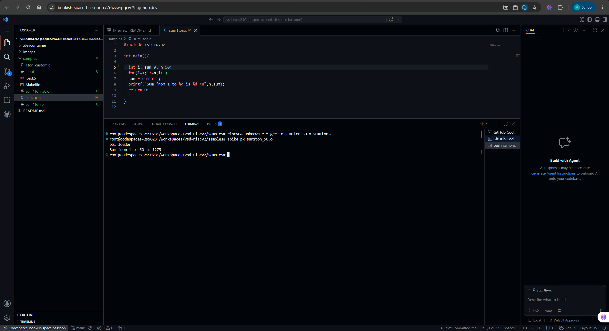

---

# Step 3: Clone and Run VSDFPGA Labs

The objective of this step is to verify the VSDFPGA development environment by cloning the FPGA labs repository, compiling a sample firmware application, and executing it using the SPIKE RISC-V simulator.

---

## Step 3.1: Clone the VSDFPGA Labs Repository

Clone the VSDFPGA Labs repository inside the Codespace environment:

```bash
git clone https://github.com/vsdip/vsdfpga_labs.git
```

After cloning, the repository was successfully downloaded and made available for further experimentation.

### Screenshot

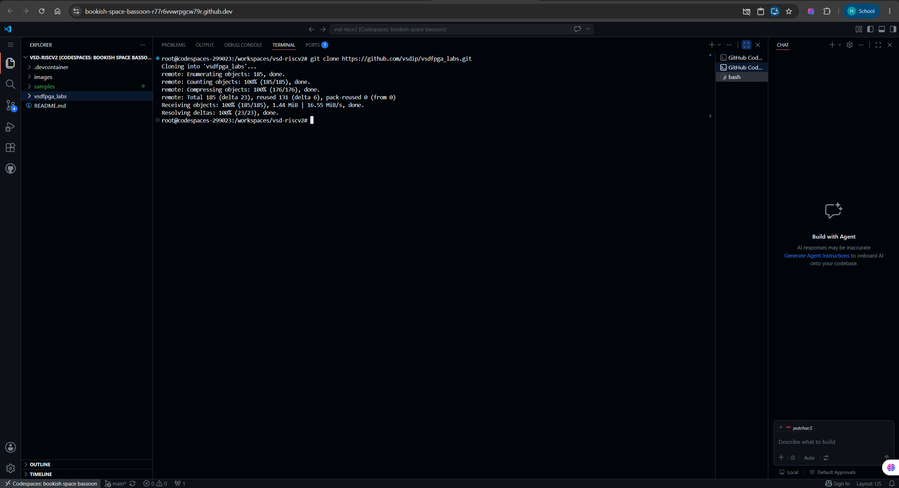

---

## Step 3.2: Navigate to the Firmware Directory

Move to the firmware directory containing the example RISC-V applications:

```bash
cd vsdfpga_labs/basicRISCV/Firmware
```

### Screenshot

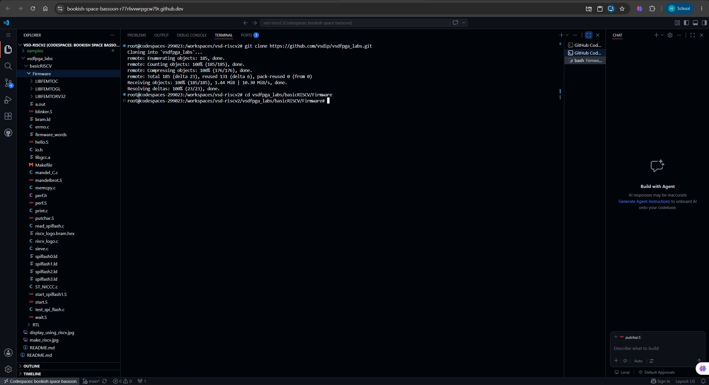

---

## Step 3.3: Examine the Source Program

Open the sample firmware program:

The source code was reviewed to understand the application before compilation.

### Screenshot

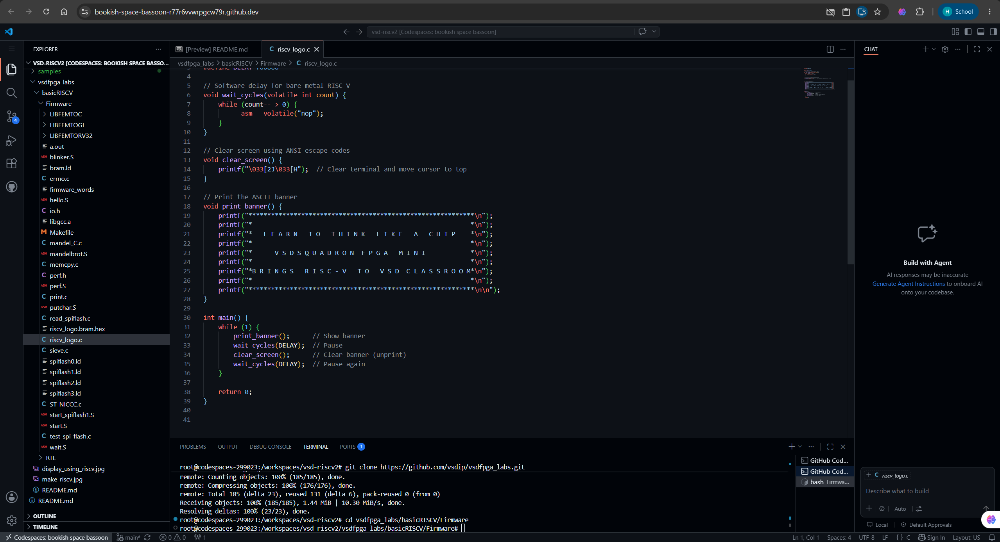

---

## Step 3.4: Compile the Firmware

Compile the firmware using the RISC-V cross compiler:

```bash
riscv64-unknown-elf-gcc -o riscv_logo.o riscv_logo.c
```

The Makefile automatically invokes the RISC-V GCC toolchain and generates the required executable files.

---

## Step 3.5: Execute Using SPIKE Simulator

Run the generated executable using the SPIKE RISC-V simulator:

```bash
spike pk riscv_logo.o
```

The firmware executed successfully and produced the expected output.

---

## Outcome

The VSDFPGA Labs repository was successfully cloned, the sample firmware was compiled using the RISC-V toolchain, and the generated executable was executed successfully using the SPIKE simulator. This verified that the complete software development flow is functioning correctly and that the environment is ready for future FPGA and IP development tasks.

### Screenshot

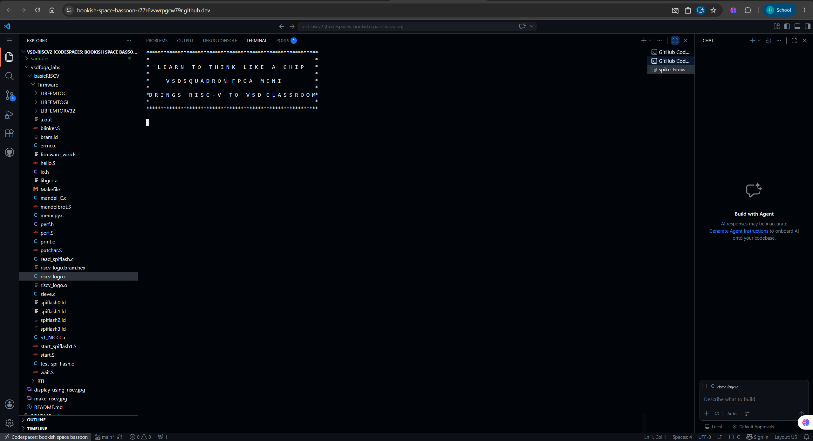

---

# Step 4: Local Machine Preparation and Validation

## Objective

Prepare a local Linux development environment capable of running both the RISC-V reference design and VSDFPGA labs without relying on GitHub Codespaces.

---

## 4.1 Create Local Workspace

A dedicated workspace directory was created and both repositories were cloned.

```bash
mkdir ~/vsd_local_setup
cd ~/vsd_local_setup

git clone https://github.com/vsdip/vsd-riscv2.git
git clone https://github.com/vsdip/vsdfpga_labs.git
```

### Screenshot

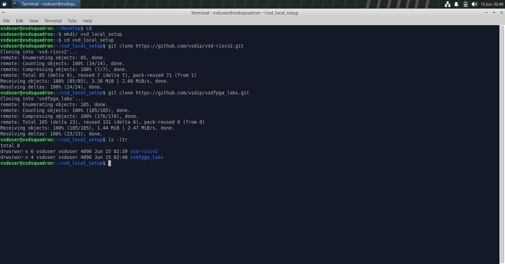

---

## 4.2 Analyze the Reference Dockerfile

The Dockerfile provided in the `vsd-riscv2` repository was studied to identify the software dependencies and development tools required for a local RISC-V environment.

Reference:

https://raw.githubusercontent.com/vsdip/vsd-riscv2/refs/heads/main/.devcontainer/Dockerfile

The Dockerfile was not executed directly. Instead, it was used as a guide for manually setting up the local environment.

The following components were identified from the Dockerfile:

- RISC-V GNU Toolchain
- Spike ISA Simulator
- RISC-V Proxy Kernel (PK)
- Git
- GCC and Build Tools
- Python3
- Icarus Verilog
- GTKWave
- Required development libraries and dependencies

This analysis helped ensure that the local environment closely match the official Codespace environment used during the internship.

---

## 4.3 Install and Configure RISC-V Toolchain

Downloaded and configured the SiFive RISC-V GCC Toolchain (v8.3.0).

Verification:

```bash
which riscv64-unknown-elf-gcc
riscv64-unknown-elf-gcc --version
```

### Screenshot

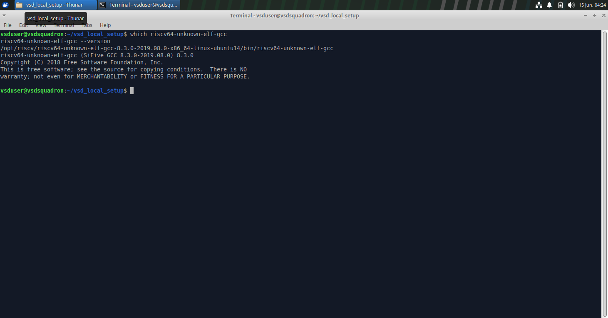

---

## 4.4 Build Spike Simulator

Spike ISA Simulator was built from source and installed successfully.

Verification:

```bash
which spike
spike --help
```

### Screenshot

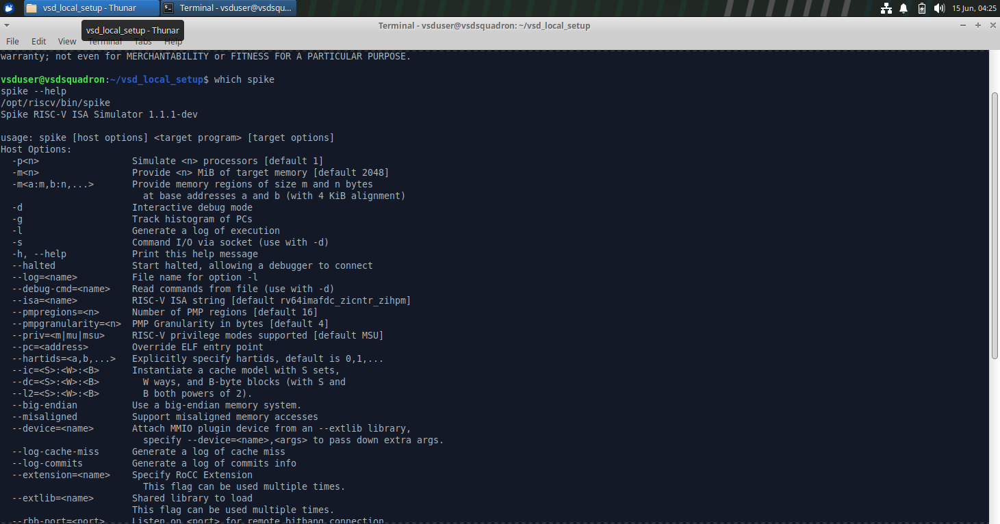

---

## 4.5 Build Proxy Kernel (PK)

The RISC-V Proxy Kernel (PK) version 1.0.0 was compiled and installed.

Verification:

```bash
git describe --tags --always
```

Output:

```text
v1.0.0
```

### Screenshot

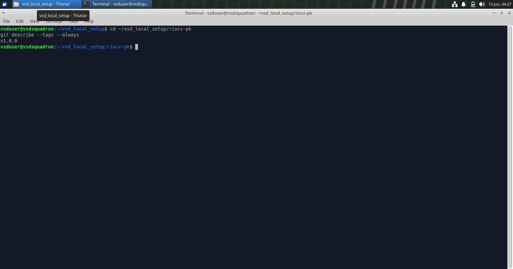

---

## 4.6 Execute Sample Program from vsd-riscv2

Navigate to:

```bash
cd ~/vsd_local_setup/vsd-riscv2/samples
```

Compile:

```bash
riscv64-unknown-elf-gcc -o sum1ton.o sum1ton.c
```

Run:

```bash
spike pk sum1ton.o
```

### Screenshot

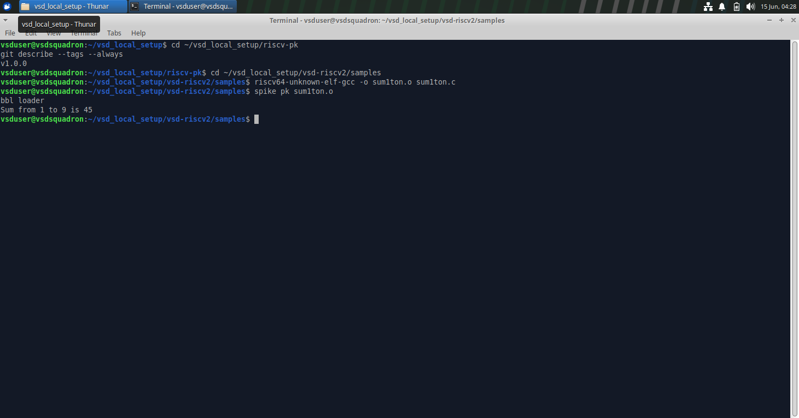

---

## 4.7 Execute VSDFPGA Firmware Example

Navigate to:

```bash
cd ~/vsd_local_setup/vsdfpga_labs/basicRISCV/Firmware
```

View source:

```bash
cat riscv_logo.c
```

### Screenshot

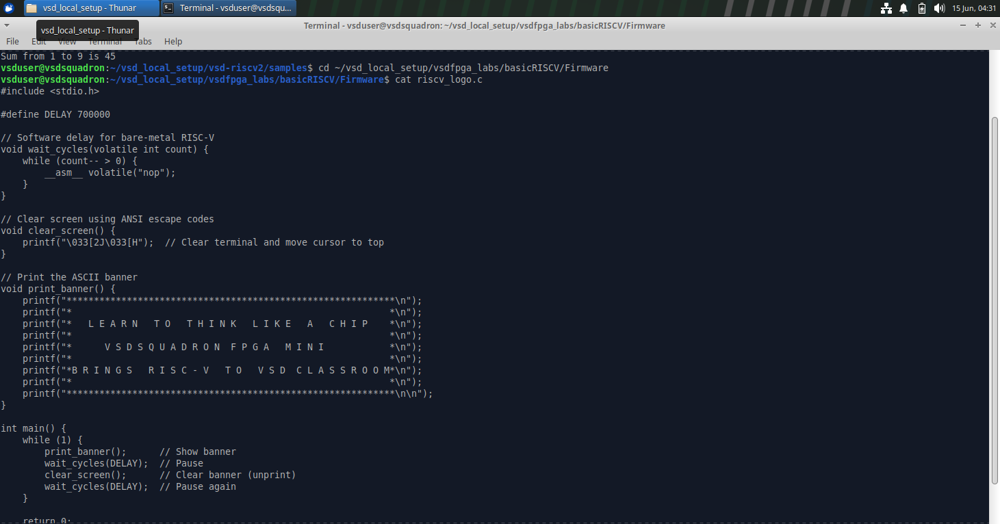

Compile:

```bash
riscv64-unknown-elf-gcc -o riscv_logo.o riscv_logo.c
```

Run:

```bash
spike pk riscv_logo.o
```

### Screenshot

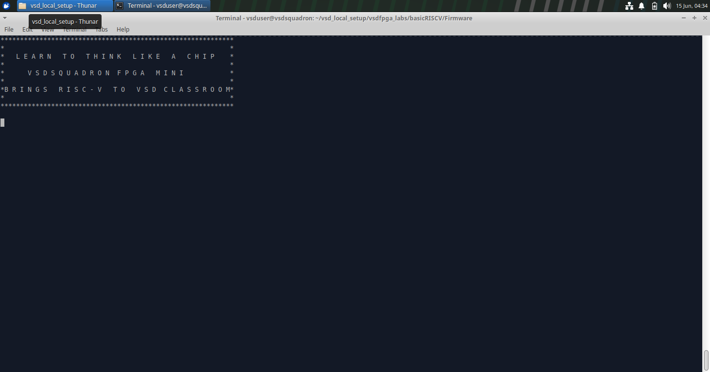

---

## Result

- Successfully prepared a local Linux development environment.
- Installed the SiFive RISC-V GCC Toolchain (v8.3.0).
- Built and installed Spike ISA Simulator.
- Built and installed RISC-V Proxy Kernel (PK v1.0.0).
- Successfully executed the `sum1ton.c` sample program from `vsd-riscv2`.
- Successfully executed the `riscv_logo.c` firmware example from `vsdfpga_labs`.
- Verified readiness for FPGA and RISC-V development workflows.

---

# Understanding Check

## Q1. Where is the RISC-V program located in the vsd-riscv2 repository?

The sample RISC-V programs are located in the `samples` directory of the `vsd-riscv2` repository. During this task, the program `sum1ton.c` was used to validate the RISC-V toolchain and execution flow.

---

## Q2. How is the program compiled and loaded into memory?

The program is compiled using the RISC-V cross-compiler:

```bash
riscv64-unknown-elf-gcc -o sum1ton.o sum1ton.c
```

This generates a RISC-V executable file. The executable is then loaded and executed using the Spike ISA simulator together with the Proxy Kernel:

```bash
spike pk sum1ton.o
```

The Proxy Kernel loads the executable into simulated memory and transfers execution control to the program.

---

## Q3. How does the RISC-V core access memory and memory-mapped I/O?

The RISC-V core accesses memory using load and store instructions. Memory-mapped I/O devices are assigned specific memory addresses within the address space. The processor communicates with peripherals by reading from or writing to these addresses using the same load/store instructions used for normal memory access.

---

## Q4. Where would a new FPGA IP block logically integrate in this system?

A new FPGA IP block would typically be integrated as a memory-mapped peripheral connected to the system bus. The RISC-V processor would interact with the IP block through its assigned address range, allowing software to configure, control, and exchange data with the hardware module.

---

# Observations

* GitHub Codespace provided a ready-to-use development environment for validating the RISC-V reference design.
* The local Linux environment required manual installation and configuration of the RISC-V GCC toolchain, Spike simulator, and Proxy Kernel.
* The `sum1ton.c` program successfully demonstrated the complete compile-execute workflow.
* The `riscv_logo.c` firmware example successfully executed on the local setup, confirming correct simulator and toolchain operation.
* Understanding the interaction between the compiler, Proxy Kernel, and Spike simulator helped clarify the RISC-V software execution flow.

---

# Key Learnings

* Learned how to set up a RISC-V development environment using both GitHub Codespaces and a local Linux machine.
* Understood the role of the RISC-V GCC cross-compiler in generating target binaries.
* Learned how Spike simulates RISC-V hardware and executes compiled programs.
* Understood the purpose of the Proxy Kernel (PK) in loading and running applications on Spike.
* Gained familiarity with memory-mapped I/O and peripheral integration concepts.
* Successfully validated both the reference RISC-V flow and the VSDFPGA lab environment.

---

# Conclusion

This task was successfully completed by setting up the required development environment, validating the RISC-V reference design, and running the VSDFPGA lab examples. Both Codespace and local execution environments were verified. The successful execution of `sum1ton.c` and `riscv_logo.c` confirms that the toolchain, simulator, and Proxy Kernel are functioning correctly and that the environment is ready for upcoming FPGA, IP integration, and SoC development tasks.

---
