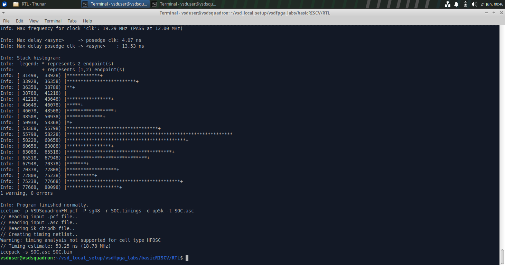
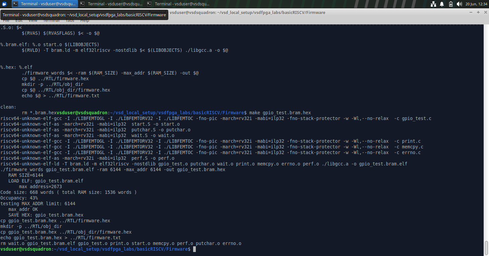
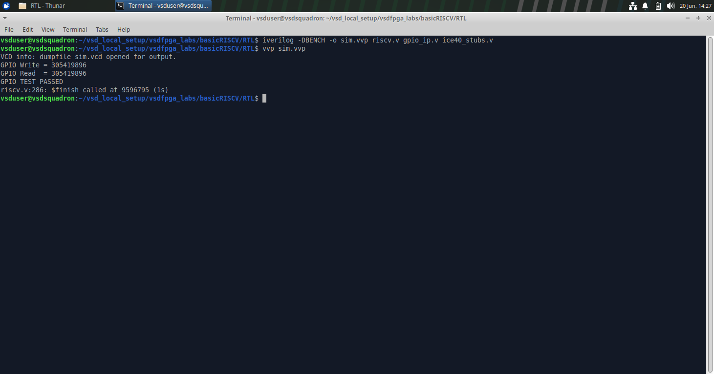
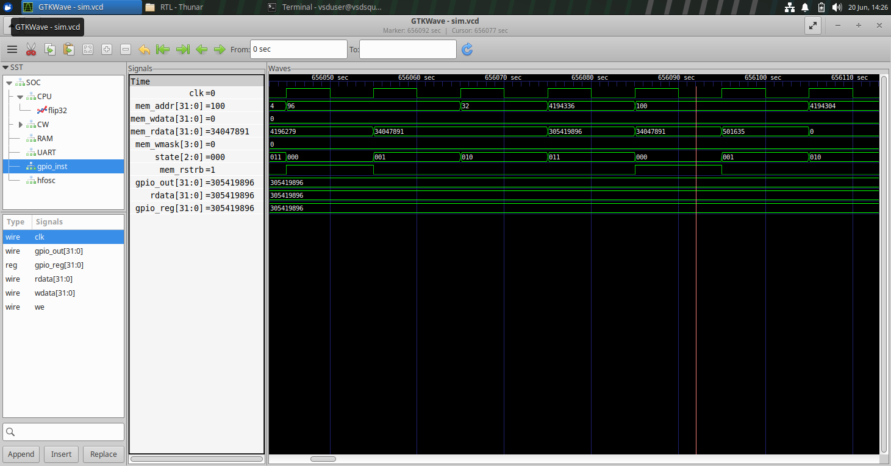

# Task 4: Design & Integrate Your First Memory-Mapped IP

## Objective

Design and integrate a custom memory-mapped GPIO IP into the provided RISC-V SoC and validate its functionality through RTL simulation.

The GPIO IP implemented in this task provides:

* One 32-bit memory-mapped register
* Write functionality through the CPU bus
* Readback functionality for software verification
* GPIO output driven by the stored register value
* Integration with the existing memory-mapped bus architecture

---
## Relevant Files Used

```text
basicRISCV/
│
├── RTL/
│   ├── riscv.v              ← SoC top-level modified for GPIO integration
│   ├── gpio_ip.v            ← Custom GPIO peripheral
│   ├── Makefile             ← Updated build configuration
│   ├── ice40_stubs.v        ← Simulation stubs used for RTL verification
│   └── sim.vvp              ← Compiled simulation executable
│
└── Firmware/
    ├── gpio_test.c          ← GPIO validation firmware
    ├── io.h                 ← GPIO address definitions
    └── gpio_test.bram.hex   ← Generated firmware image


```

## File Description

### `riscv.v`

Top-level RISC-V SoC design file responsible for connecting the CPU, memory, UART, and memory-mapped peripherals.

---

### `gpio_ip.v`

Custom GPIO peripheral implementing a 32-bit memory-mapped register with read and write capability.

---

### `Makefile`

Build automation file used for synthesis, implementation, simulation, and FPGA programming of the design.

---

### `io.h`

Firmware header file containing memory-mapped peripheral definitions and address mappings used by software applications.

---

### `gpio_test.c`

Firmware application developed to verify the functionality of the integrated GPIO peripheral.

---

### `ice40_stubs.v`

Simulation support file used to replace FPGA-specific primitives during RTL simulation with Icarus Verilog.

---

### `gpio_test.bram.hex`

Memory initialization file generated from the firmware program and loaded into the SoC memory during simulation.

---

### `sim.vvp`

Compiled Icarus Verilog simulation executable used to run RTL verification.

---

### `sim.vcd`

Waveform dump file generated during simulation and analyzed using GTKWave.

---

## Step-1: Understanding the Existing SoC (`riscv.v`)

Before designing the GPIO IP, the architecture of the provided RISC-V SoC was studied to understand how the processor communicates with memory and peripherals. The objective of this step was to identify the bus interface, address decoding mechanism, and peripheral integration methodology already present in the design.

### 1(a) The SoC Top-Level Module

The `SOC` module acts as the top-level integration point of the system. It connects:

* RISC-V Processor
* RAM
* UART Peripheral
* LED Peripheral
* Clock and Reset Logic

All peripherals communicate with the processor through a common memory-mapped bus interface.

---

### 1(b) CPU Bus Interface

The processor communicates with memory and peripherals using the following bus signals:

```verilog
wire [31:0] mem_addr;
wire [31:0] mem_rdata;
wire        mem_rstrb;
wire [31:0] mem_wdata;
wire [3:0]  mem_wmask;
```

These signals form the communication interface between the CPU and all memory-mapped peripherals.

| Signal      | Description                  |
| ----------- | ---------------------------- |
| `mem_addr`  | Address generated by the CPU |
| `mem_wdata` | Data written by the CPU      |
| `mem_rdata` | Data returned to the CPU     |
| `mem_rstrb` | Read request signal          |
| `mem_wmask` | Write request signal         |

From this interface, it can be observed that the processor interacts with peripherals only through bus transactions. All peripheral logic must respond to these bus signals.

---

### 1(c) Memory-Mapped I/O Structure

The SoC separates memory accesses from peripheral accesses using address decoding.

```verilog
wire isIO  = mem_addr[22];
wire isRAM = !isIO;
```

This means:

* `mem_addr[22] = 0` → RAM Access
* `mem_addr[22] = 1` → Peripheral Access

The processor generates an address along with read or write control signals, while the SoC determines whether the transaction is directed to memory or to a peripheral.

---

### 1(d) Word-Aligned Peripheral Addressing

The SoC uses word-aligned addressing:

```verilog
wire [29:0] mem_wordaddr = mem_addr[31:2];
```

Since accesses are 32-bit wide, the two least significant address bits are ignored.

The existing peripheral mapping is defined as:

```verilog
localparam IO_LEDS_bit      = 0;
localparam IO_UART_DAT_bit  = 1;
localparam IO_UART_CNTL_bit = 2;
```

| Peripheral            | Address Bit | Function                |
| --------------------- | ----------- | ----------------------- |
| LED Register          | Bit 0       | Controls board LEDs     |
| UART Data Register    | Bit 1       | Sends data through UART |
| UART Control Register | Bit 2       | Returns UART status     |

This addressing mechanism provides a simple method for selecting peripherals within the I/O address space.

---

### 1(e) Existing Memory-Mapped Peripherals

Before integrating the GPIO IP, the existing peripherals in the SoC were analyzed as reference implementations.

#### LED Peripheral

The LED peripheral is implemented directly inside the SoC and updates the LED output whenever a write operation is performed to the corresponding memory-mapped address.

```verilog
always @(posedge clk) begin
   if(isIO & mem_wstrb & mem_wordaddr[IO_LEDS_bit])
      LEDS <= mem_wdata;
end
```

Key observations:

* Uses memory-mapped addressing
* Uses `mem_wdata` as input data
* Uses address decoding for peripheral selection
* Updates synchronously with the clock

---

#### UART Peripheral

The UART peripheral is also memory-mapped and is accessed through dedicated address bits.

Key observations:

* UART transmission is triggered through memory writes.
* UART status is returned through the read-data path.
* Readback is integrated into the shared bus using `IO_rdata`.

The UART implementation provided a useful reference for integrating the custom GPIO IP in later steps.

---

## Step-2: Designing the GPIO IP RTL ([`gpio_ip.v`](RTL/gpio_ip.v))

After understanding the SoC architecture and bus interface, a custom memory-mapped GPIO peripheral was designed.

The objective of this step was to create a standalone RTL module capable of:

* Storing data written by the CPU
* Returning the stored value during read operations
* Driving an output signal using the stored register value

The GPIO IP was implemented in a separate file named `gpio_ip.v`.

---

### 2(a) GPIO IP Interface

The GPIO module exposes the following interface:

```verilog
module gpio_ip(
    input clk,
    input we,
    input [31:0] wdata,
    output [31:0] rdata,
    output [31:0] gpio_out
);
```

| Signal     | Direction | Description              |
| ---------- | --------- | ------------------------ |
| `clk`      | Input     | System clock             |
| `we`       | Input     | Write enable signal      |
| `wdata`    | Input     | Data written by the CPU  |
| `rdata`    | Output    | Data returned to the CPU |
| `gpio_out` | Output    | GPIO output signal       |

The module communicates with the SoC through these signals and behaves as a memory-mapped peripheral.

---

### 2(b) Register Storage

A 32-bit register was created to store the value written by the processor.

```verilog
reg [31:0] gpio_reg;
```

This register acts as the internal storage element of the GPIO IP.

---

### 2(c) Write Logic

The GPIO register is updated whenever a valid write operation occurs.

```verilog
always @(posedge clk) begin
    if(we)
        gpio_reg <= wdata;
end
```

Operation:

* Write operations occur on the rising edge of the clock.
* When `we` is asserted, the value present on `wdata` is stored in `gpio_reg`.
* The previously stored value is overwritten by the new data.

This implements the write functionality required by the specification.

---

### 2(d) Readback Logic

The GPIO IP supports read operations by returning the current register contents.

```verilog
assign rdata = gpio_reg;
```

Whenever the CPU performs a read operation, the value stored in `gpio_reg` is returned through `rdata`.

This allows software to verify previously written values.

---

### 2(e) GPIO Output Logic

The output of the GPIO IP is directly driven by the internal register.

```verilog
assign gpio_out = gpio_reg;
```

As a result:

* Any value written by the CPU immediately appears on the GPIO output.
* The output always reflects the current register contents.

---

## Step-3: Integrating the GPIO IP into the SoC ([`riscv.v`](RTL/riscv.v))

After designing the GPIO peripheral, the next step was to integrate it into the existing RISC-V SoC. This required assigning a memory-mapped address, connecting the GPIO IP to the CPU bus, and integrating its readback path into the SoC.

---

### 3(a) GPIO Address Allocation

A new memory-mapped address location was allocated for the GPIO peripheral by defining a new address bit.

```verilog
localparam IO_GPIO_bit = 3;
```

The existing peripherals occupied bits 0, 1 and 2. Assigning bit 3 created a dedicated address location for the GPIO IP within the I/O address space.

| Peripheral            | Address Bit |
| --------------------- | ----------- |
| LED Register          | 0           |
| UART Data Register    | 1           |
| UART Control Register | 2           |
| GPIO Register         | 3           |

---

### 3(b) GPIO Signal Declaration

New signals were declared to connect the GPIO peripheral to the SoC bus.

```verilog
wire [31:0] gpio_rdata;
wire [31:0] gpio_out;
```

| Signal       | Purpose                                             |
| ------------ | --------------------------------------------------- |
| `gpio_rdata` | Data returned by the GPIO IP during read operations |
| `gpio_out`   | GPIO output driven by the internal register         |

These signals form the interface between the GPIO peripheral and the SoC.

---

### 3(c) GPIO IP Instantiation

The GPIO IP was instantiated inside the `SOC` module and connected to the processor bus.

```verilog
gpio_ip gpio_inst(
    .clk(clk),
    .we(isIO & mem_wstrb & mem_wordaddr[IO_GPIO_bit]),
    .wdata(mem_wdata),
    .rdata(gpio_rdata),
    .gpio_out(gpio_out)
);
```

The write-enable signal is generated using:

* `isIO` → Ensures the access targets an I/O peripheral.
* `mem_wstrb` → Indicates a valid write operation.
* `mem_wordaddr[IO_GPIO_bit]` → Selects the GPIO address.

Whenever all three conditions are true, the value on `mem_wdata` is written into the GPIO register.

---

### 3(d) Readback Integration

To allow software to read the GPIO register, the GPIO read data was integrated into the SoC read-data multiplexer.

```verilog
wire [31:0] IO_rdata =
       mem_wordaddr[IO_UART_CNTL_bit] ? {22'b0,!uart_ready,9'b0} :
       mem_wordaddr[IO_GPIO_bit]      ? gpio_rdata :
                                        32'b0;
```

When the GPIO address is selected, the value stored in the GPIO register is returned through `gpio_rdata`.

This enables software verification of the data written to the peripheral.

---

### 3(e) Build Flow Update

The FPGA build flow was updated to include the custom GPIO IP module during synthesis.

### Makefile Modification

Original:

```makefile
VERILOG_FILE= riscv.v
```

Modified:

```makefile
VERILOG_FILE= riscv.v gpio_ip.v
```

This ensures that the GPIO IP is compiled together with the RISC-V SoC during synthesis and implementation.

### Relevant File

- [`Makefile`](Makefile)

---

### 3(f) Build Verification

After integrating the GPIO peripheral, the design was rebuilt to verify that the modified SoC compiled successfully.

```bash
make clean
make
```

The synthesis completed successfully without errors, confirming that the GPIO IP was correctly connected to the SoC and that all modifications were syntactically and functionally valid.

### Screenshot



---

## Step-4: Firmware Development and RTL Verification

After integrating the GPIO IP into the SoC, a software test program was developed to verify correct GPIO operation. The verification process included firmware development, RTL simulation, and waveform analysis using GTKWave.

---

### 4(a) Modification of io.h

To enable software access to the newly integrated GPIO peripheral, a GPIO I/O definition was added to `io.h`.

```c
#define IO_GPIO 32
```

This definition allows the firmware to communicate with the GPIO peripheral through the existing `IO_IN()` and `IO_OUT()` macros.

### Relevant File

- [`io.h`](Firmware/io.h)

---

### 4(b) Developing GPIO Test Firmware

A firmware program named [`gpio_test.c`](Firmware/gpio_test.c) was created to validate the GPIO peripheral.

The program performs the following operations:

1. Writes a test value to the GPIO register.
2. Reads the value back from the GPIO register.
3. Compares the written and read values.
4. Prints the result through UART.

The test value used was:

```c
0x12345678
```

This value was chosen because it is easily identifiable during waveform analysis.

---

### 4(c) Firmware Compilation

The firmware was compiled and converted into a memory initialization file using:

```bash
make clean
make gpio_test.bram.hex
```

This generated the firmware image that was later loaded into memory during simulation.

### Screenshot



---

### 4(d) RTL Simulation Setup

RTL simulation was performed using Icarus Verilog.

To support simulation, FPGA-specific primitives such as `SB_HFOSC` and `SB_PLL40_CORE` were replaced using [`ice40_stubs.v`](RTL/ice40_stubs.v).

The simulation was compiled and executed using:

```bash
iverilog -DBENCH -o sim.vvp riscv.v gpio_ip.v ice40_stubs.v
vvp sim.vvp
```

---

### 4(e) Simulation Results

The UART output generated during simulation confirmed successful GPIO operation.

```text
GPIO Write = 305419896
GPIO Read  = 305419896
GPIO TEST PASSED
```

Since:

```text
305419896 = 0x12345678
```

the read value exactly matched the written value.

This verifies that:

* The processor successfully accessed the GPIO peripheral.
* The GPIO register stored the written value correctly.
* The readback path returned the correct data.
* The memory-mapped interface operated as expected.

### Screenshot



---

### 4(f) GTKWave Verification

A waveform dump (`sim.vcd`) was generated during simulation and analyzed using GTKWave.

The following signals were observed:

| Signal      | Description                  |
| ----------- | ---------------------------- |
| `mem_addr`  | Address generated by the CPU |
| `mem_wdata` | Data written to GPIO         |
| `gpio_reg`  | Internal GPIO register       |
| `gpio_out`  | GPIO output signal           |
| `rdata`     | Data returned to the CPU     |

Waveform observations:

* `mem_addr = 32` confirms access to the GPIO register address.
* `mem_wdata = 0x12345678` shows the value written by the CPU.
* `gpio_reg = 0x12345678` confirms successful register update.
* `gpio_out = 0x12345678` confirms correct GPIO output generation.
* `rdata = 0x12345678` confirms successful readback operation.

### Screenshot



---

---

# Observations

- The GPIO IP was successfully integrated into the VSD Squadron RISC-V SoC using memory-mapped I/O.
- Write operations from firmware correctly updated the GPIO register inside the custom peripheral.
- Read operations successfully returned the stored GPIO value to the processor.
- RTL simulation using Icarus Verilog verified correct communication between the CPU and the GPIO peripheral.
- GTKWave analysis confirmed successful GPIO transactions and correct signal behavior during read and write operations.
- The GPIO output value remained synchronized with the internal GPIO register throughout execution.

---

# Key Learnings

- Learned how custom peripherals can be integrated into a RISC-V SoC using memory-mapped I/O.
- Understood the process of address decoding and peripheral selection within the SoC.
- Learned how firmware interacts with hardware peripherals through dedicated memory addresses.
- Gained experience designing and integrating a custom Verilog IP block.
- Learned how RTL simulation can be used to validate SoC functionality before FPGA deployment.
- Improved understanding of waveform-based debugging using GTKWave.
- Successfully validated end-to-end interaction between firmware, processor, bus logic, and custom GPIO hardware.

---

# Conclusion

This task successfully demonstrated the complete integration and verification flow of a custom GPIO peripheral within the VSD Squadron RISC-V SoC. The GPIO IP was designed, connected to the SoC memory map, and accessed through firmware running on the RISC-V processor. RTL simulation confirmed successful GPIO write and read operations, while GTKWave verification validated the corresponding hardware signals. The task provided practical experience in SoC peripheral integration, memory-mapped I/O design, firmware development, and RTL-level debugging.
