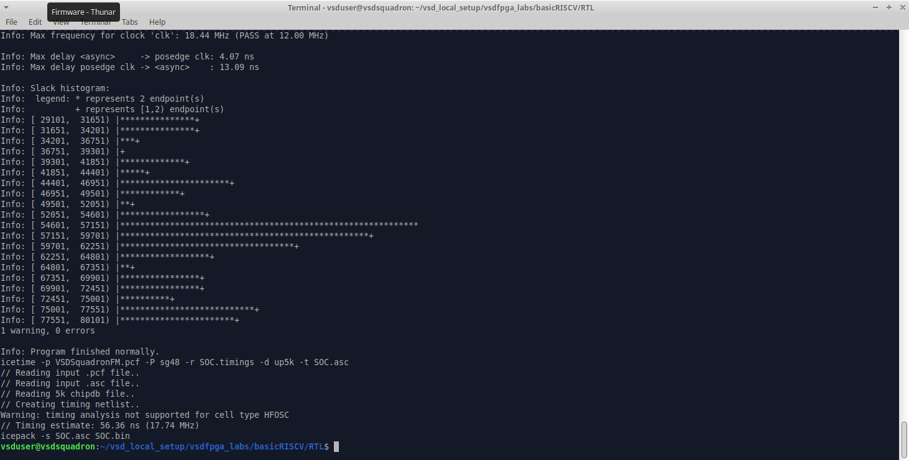
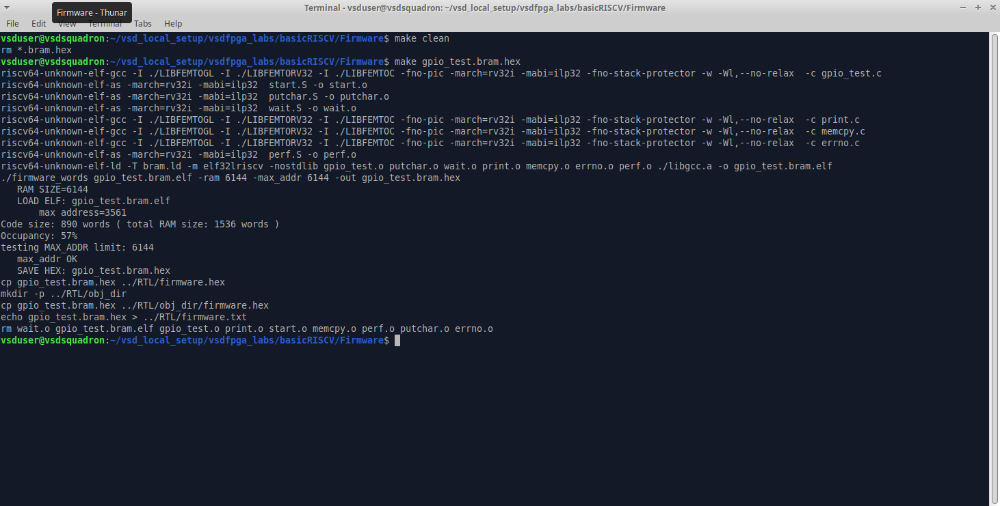
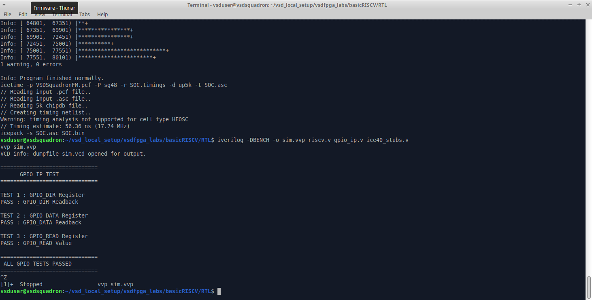
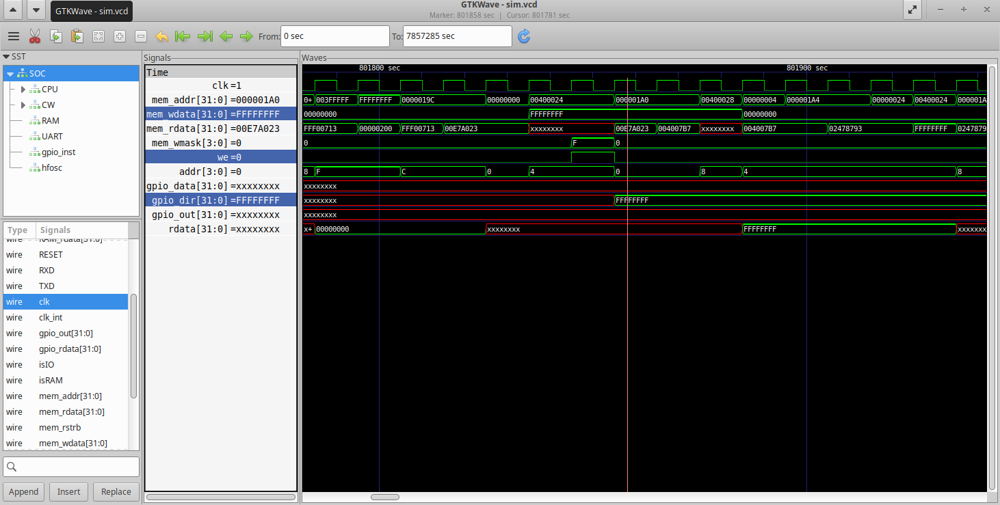
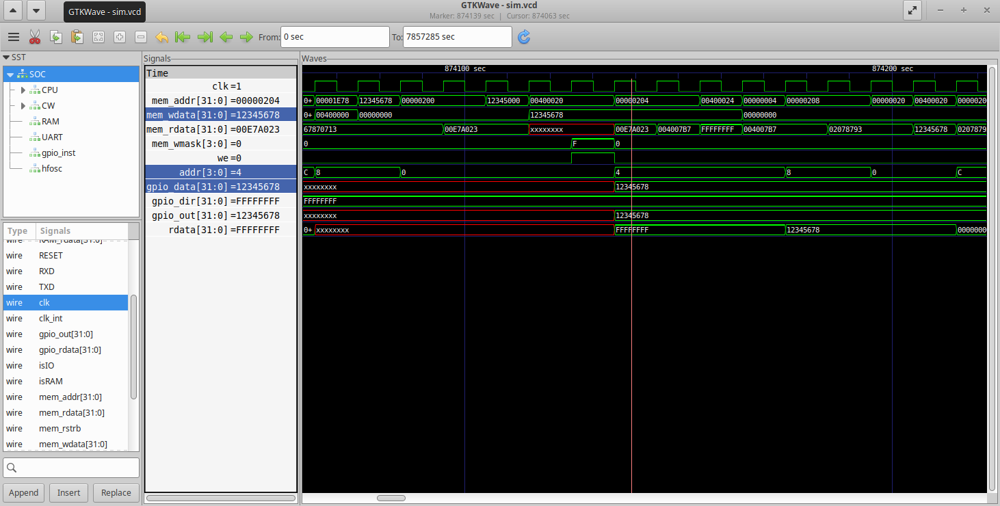
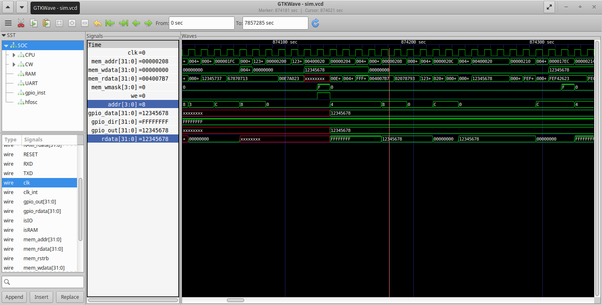
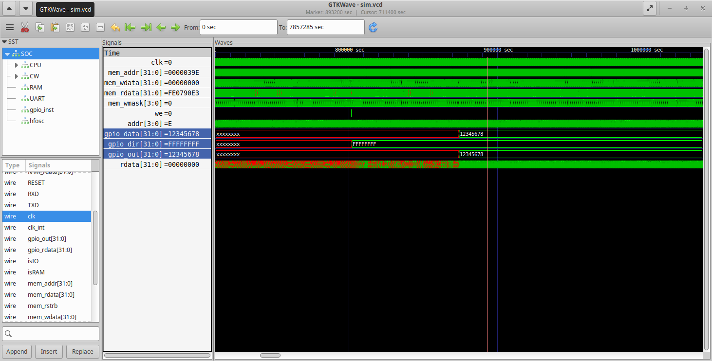

# Task 5: Design & Integrate a Multi-Register GPIO IP

## Objective

Design and integrate a custom multi-register memory-mapped GPIO IP into the provided RISC-V SoC and validate its functionality through RTL simulation.

The GPIO IP implemented in this task provides:

* Three 32-bit memory-mapped registers
* GPIO_DATA register for storing output values
* GPIO_DIR register for configuring pin directions
* GPIO_READ register for reading current GPIO pin values
* Memory-mapped read and write functionality
* GPIO output generation based on data and direction registers
* Integration with the existing RISC-V SoC memory-mapped bus architecture
* Firmware-based verification using UART
* RTL verification using Icarus Verilog and GTKWave

---

## Relevant Files Used

```text
basicRISCV/
│
├── RTL/
│   ├── riscv.v              ← SoC top-level modified for GPIO integration
│   ├── gpio_ip.v            ← Multi-register GPIO peripheral
│   ├── Makefile             ← Updated build configuration
│   ├── ice40_stubs.v        ← Simulation stubs used for RTL verification
│   └── sim.vvp              ← Compiled simulation executable
│
└── Firmware/
    ├── gpio_test.c          ← GPIO validation firmware
    ├── io.h                 ← GPIO register definitions
    └── gpio_test.bram.hex   ← Generated firmware image
```

---

## File Description

- `riscv.v`: Top-level RISC-V SoC design file responsible for integrating the processor, memory, UART, and memory-mapped peripherals.

- `gpio_ip.v`: Custom multi-register GPIO peripheral implementing GPIO_DATA, GPIO_DIR, and GPIO_READ registers.

- `Makefile`: Build automation file used for synthesis, RTL simulation, and FPGA implementation.

- `io.h`: Firmware header file containing memory-mapped GPIO register definitions used by software applications.

- `gpio_test.c`: Firmware application developed to verify all GPIO registers through memory-mapped read and write operations.

- `ice40_stubs.v`: Behavioral models of FPGA-specific primitives used to enable RTL simulation with Icarus Verilog.

- `gpio_test.bram.hex`: Memory initialization file generated from the firmware and loaded into the SoC during simulation.

- `sim.vvp`: Compiled Icarus Verilog simulation executable used for RTL verification.

---

# Step-1: Understanding the Existing SoC (`riscv.v`)

Before designing the multi-register GPIO IP, the architecture of the provided RISC-V SoC was studied to understand how the processor communicates with memory and peripherals. The objective of this step was to identify the bus interface, address decoding mechanism, and peripheral integration methodology already present in the design.

## 1.1 The SoC Top-Level Module

The `SOC` module acts as the top-level integration point of the system. It connects:

* RISC-V Processor
* RAM
* UART Peripheral
* LED Peripheral
* Clock and Reset Logic

All peripherals communicate with the processor through a common memory-mapped bus interface.

---

## 1.2 CPU Bus Interface

The processor communicates with memory and peripherals using the following bus signals:

```verilog
wire [31:0] mem_addr;
wire [31:0] mem_rdata;
wire        mem_rstrb;
wire [31:0] mem_wdata;
wire [3:0]  mem_wmask;
```

These signals form the communication interface between the CPU and all memory-mapped peripherals.

| Signal | Description |
|---------|-------------|
| `mem_addr` | Address generated by the CPU |
| `mem_wdata` | Data written by the CPU |
| `mem_rdata` | Data returned to the CPU |
| `mem_rstrb` | Read request signal |
| `mem_wmask` | Write request signal |

From this interface, it can be observed that the processor interacts with peripherals only through bus transactions. Every peripheral must decode the address, respond to read and write requests, and exchange data through these shared bus signals.

---

## 1.3 Memory-Mapped I/O Structure

The SoC separates memory accesses from peripheral accesses using address decoding.

```verilog
wire isIO  = mem_addr[22];
wire isRAM = !isIO;
```

This means:

* `mem_addr[22] = 0` → RAM Access
* `mem_addr[22] = 1` → Peripheral Access

The processor generates an address together with the appropriate control signals, while the SoC determines whether the transaction targets memory or a memory-mapped peripheral.

---

## 1.4 Word-Aligned Peripheral Addressing

The SoC uses word-aligned addressing:

```verilog
wire [29:0] mem_wordaddr = mem_addr[31:2];
```

Since the processor performs 32-bit accesses, the two least significant address bits are ignored.

The existing peripheral mapping is defined as:

```verilog
localparam IO_LEDS_bit      = 0;
localparam IO_UART_DAT_bit  = 1;
localparam IO_UART_CNTL_bit = 2;
```

During this task, a new GPIO peripheral is integrated by allocating an additional address location.

| Peripheral | Address Bit | Function |
|------------|------------|----------|
| LED Register | 0 | Controls board LEDs |
| UART Data Register | 1 | Sends data through UART |
| UART Control Register | 2 | Returns UART status |
| GPIO Peripheral | 3 | Multi-register GPIO IP |

This addressing mechanism allows multiple peripherals to coexist within the same memory-mapped I/O space while remaining independently accessible by software.

---

## 1.5 Existing Memory-Mapped Peripherals

Before integrating the custom GPIO IP, the existing peripherals in the SoC were analyzed to understand how memory-mapped devices communicate with the processor.

### LED Peripheral

The LED peripheral is implemented directly inside the SoC and updates the LED output whenever a write operation is performed to its assigned memory-mapped address.

```verilog
always @(posedge clk) begin
    if(isIO & mem_wstrb & mem_wordaddr[IO_LEDS_bit])
        LEDS <= mem_wdata;
end
```

Key observations:

* Uses memory-mapped addressing
* Uses `mem_wdata` as input data
* Uses address decoding for peripheral selection
* Updates synchronously with the system clock

---

### UART Peripheral

The UART peripheral is also memory-mapped and is accessed through dedicated address bits.

Key observations:

* UART transmission is initiated through memory write operations.
* UART status is returned through the read-data path.
* Readback is integrated into the shared bus using `IO_rdata`.

The LED and UART peripherals served as reference implementations while designing and integrating the custom multi-register GPIO IP.

---

# Step-2: Designing the Multi-Register GPIO IP ([`gpio_ip.v`](RTL/gpio_ip.v))

After understanding the SoC architecture and memory-mapped bus interface, a custom multi-register GPIO peripheral was designed.

Unlike the GPIO IP developed in Task 4, which contained a single memory-mapped register, this version implements multiple registers to provide greater flexibility and functionality. The peripheral supports configurable GPIO direction, output data storage, and register readback through a common memory-mapped interface.

The GPIO IP was implemented in a separate file named `gpio_ip.v`.

---

## 2.1 GPIO IP Interface

The GPIO module exposes the following interface:

```verilog
module gpio_ip(
    input             clk,
    input             we,
    input      [3:0]  addr,
    input      [31:0] wdata,
    output reg [31:0] rdata,
    output     [31:0] gpio_out
);
```

| Signal | Direction | Description |
|----------|-----------|-------------|
| `clk` | Input | System clock |
| `we` | Input | Write enable signal |
| `addr` | Input | Register address offset |
| `wdata` | Input | Data written by the CPU |
| `rdata` | Output | Data returned during read operations |
| `gpio_out` | Output | GPIO output values |

The additional `addr` signal allows the peripheral to support multiple internal registers using a single memory-mapped address space.

---

## 2.2 GPIO Register Map

The GPIO peripheral contains three memory-mapped registers.

| Offset | Register | Access | Description |
|---------|----------|--------|-------------|
| `0x00` | GPIO_DATA | Read / Write | Stores GPIO output data |
| `0x04` | GPIO_DIR | Read / Write | Configures GPIO pin direction |
| `0x08` | GPIO_READ | Read Only | Returns the current GPIO output values |

The CPU selects one of these registers by providing the corresponding address offset through the `addr` input.

---

## 2.3 Register Storage

Two internal 32-bit registers are used to store the GPIO configuration.

```verilog
reg [31:0] gpio_data;
reg [31:0] gpio_dir;
```

- `gpio_data` stores the values written by software that will be driven onto the GPIO outputs.
- `gpio_dir` determines whether each GPIO pin operates as an output or an input.

The `GPIO_READ` register is not physically stored. Instead, its value is generated dynamically from the current GPIO output state during read operations.

---

## 2.4 Address Decoding

Since multiple registers share the same peripheral address, the GPIO IP internally decodes the lower address bits to determine which register is being accessed.

The address mapping is implemented using a `case` statement.

```verilog
case(addr)
    4'h0 : ...
    4'h4 : ...
    4'h8 : ...
endcase
```

This allows the processor to access different registers within the GPIO peripheral while using a single memory-mapped device.

---

## 2.5 Write Logic

Write operations occur synchronously on the rising edge of the system clock.

Whenever the write enable signal is asserted, the GPIO IP stores the incoming data into the register selected by the address input.

```verilog
always @(posedge clk) begin
    if(we) begin
        case(addr)
            4'h0: gpio_data <= wdata;
            4'h4: gpio_dir  <= wdata;
        endcase
    end
end
```

Only the `GPIO_DATA` and `GPIO_DIR` registers are writable. The `GPIO_READ` register is read-only.

---

## 2.6 Read Logic

Read operations return the contents of the register selected by the address input.

```verilog
always @(*) begin
    case(addr)
        4'h0: rdata = gpio_data;
        4'h4: rdata = gpio_dir;
        4'h8: rdata = gpio_out;
        default: rdata = 32'b0;
    endcase
end
```

This enables software to verify previously written values and observe the current GPIO output state.

---

## 2.7 GPIO Output Logic

The GPIO output is generated by combining the output data register with the direction register.

```verilog
assign gpio_out = gpio_data & gpio_dir;
```

Only GPIO pins configured as outputs drive the corresponding data values.

For each GPIO pin:

- Direction bit = `1` → Output enabled
- Direction bit = `0` → Output disabled

As a result, the GPIO output always reflects the values stored in `GPIO_DATA` for pins configured as outputs.

---

# Step-3: Integrating the GPIO IP into the SoC ([`riscv.v`](RTL/riscv.v))

After designing the multi-register GPIO peripheral, the next step was to integrate it into the existing RISC-V SoC. This involved assigning a memory-mapped address, connecting the GPIO IP to the CPU bus, and integrating its readback path into the SoC.

---

## 3.1 GPIO Address Allocation

A dedicated memory-mapped address location was allocated for the GPIO peripheral by defining a new address bit.

```verilog
localparam IO_GPIO_bit = 3;
```

The existing peripherals occupied bits 0, 1, and 2. Assigning bit 3 created a dedicated address location for the GPIO IP within the I/O address space.

| Peripheral | Address Bit |
|------------|-------------|
| LED Register | 0 |
| UART Data Register | 1 |
| UART Control Register | 2 |
| GPIO Peripheral | 3 |

Although the GPIO IP internally contains multiple registers, it occupies only one peripheral slot in the SoC memory map. Register selection is handled internally using the lower address bits.

---

## 3.2 GPIO Signal Declaration

New signals were declared to connect the GPIO peripheral to the SoC bus.

```verilog
wire [31:0] gpio_rdata;
wire [31:0] gpio_out;
```

| Signal | Purpose |
|----------|---------|
| `gpio_rdata` | Data returned by the GPIO IP during read operations |
| `gpio_out` | GPIO output generated by the GPIO peripheral |

These signals form the communication interface between the GPIO IP and the SoC.

---

## 3.3 GPIO IP Instantiation

The GPIO IP was instantiated inside the `SOC` module and connected to the processor bus.

```verilog
gpio_ip gpio_inst(
    .clk(clk),
    .we(isIO & mem_wstrb & mem_wordaddr[IO_GPIO_bit]),
    .addr(mem_addr[3:0]),
    .wdata(mem_wdata),
    .rdata(gpio_rdata),
    .gpio_out(gpio_out)
);
```

The write-enable signal is generated using:

- `isIO` → Ensures the transaction targets an I/O peripheral.
- `mem_wstrb` → Indicates a valid write operation.
- `mem_wordaddr[IO_GPIO_bit]` → Selects the GPIO peripheral.

The lower address bits (`mem_addr[3:0]`) are forwarded to the GPIO IP, allowing it to select between the `GPIO_DATA`, `GPIO_DIR`, and `GPIO_READ` registers internally.

---

## 3.4 Readback Integration

To allow software to read the GPIO registers, the GPIO read data was integrated into the SoC read-data multiplexer.

```verilog
wire [31:0] IO_rdata =
       mem_wordaddr[IO_UART_CNTL_bit] ? {22'b0,!uart_ready,9'b0} :
       mem_wordaddr[IO_GPIO_bit]      ? gpio_rdata :
                                        32'b0;
```

Whenever the GPIO peripheral is selected, the value returned by the GPIO IP is forwarded to the processor through `gpio_rdata`.

The specific register returned depends on the address decoded inside the GPIO IP.

---

## 3.5 Build Flow Update

The FPGA build flow was updated to include the modified GPIO IP during synthesis.

### Makefile Modification

Original:

```makefile
VERILOG_FILE = riscv.v
```

Modified:

```makefile
VERILOG_FILE = riscv.v gpio_ip.v
```

This ensures that the custom GPIO peripheral is compiled together with the RISC-V SoC during synthesis and implementation.

### Relevant File

- [`Makefile`](RTL/Makefile)

---

## 3.6 Build Verification

After integrating the multi-register GPIO peripheral, the design was rebuilt to verify that the modified SoC compiled successfully.

```bash
make clean
make
```

The synthesis completed successfully without errors, confirming that the GPIO IP was correctly connected to the SoC and that all hardware modifications were valid.

### Screenshot



---

# Step-4: Firmware Development and RTL Verification

After integrating the multi-register GPIO IP into the SoC, a firmware application was developed to verify the functionality of all GPIO registers. The verification process included firmware development, RTL simulation, UART output verification, and waveform analysis using GTKWave.

---

## 4.1 Updating `io.h`

To enable software access to the newly integrated GPIO peripheral, register definitions were added to `io.h`.

```c
#define GPIO_DATA (*(volatile uint32_t*)(IO_BASE + IO_GPIO + 0x0))
#define GPIO_DIR  (*(volatile uint32_t*)(IO_BASE + IO_GPIO + 0x4))
#define GPIO_READ (*(volatile uint32_t*)(IO_BASE + IO_GPIO + 0x8))
```

These definitions allow firmware to access each GPIO register through memory-mapped I/O using standard read and write operations.

### Relevant File

- [`io.h`](Firmware/io.h)

---

## 4.2 Developing GPIO Test Firmware

A firmware application named [`gpio_test.c`](Firmware/gpio_test.c) was developed to verify the functionality of the GPIO peripheral.

The program performs the following operations:

1. Configures the GPIO direction register.
2. Verifies the `GPIO_DIR` register through readback.
3. Writes a test pattern to the `GPIO_DATA` register.
4. Verifies the `GPIO_DATA` register through readback.
5. Reads the `GPIO_READ` register.
6. Prints PASS or FAIL messages through UART for each verification step.

The test value used was:

```text
0x12345678
```

This value was chosen because it is easily recognizable during waveform analysis and software verification.

---

## 4.3 Firmware Compilation

The firmware was compiled and converted into a memory initialization file using:

```bash
make clean
make gpio_test.bram.hex
```

This generated the firmware image that was later loaded into the SoC memory during RTL simulation.

### Screenshot



---

## 4.4 RTL Simulation

RTL simulation was performed using Icarus Verilog.

The complete SoC, including the processor, UART, RAM, and custom GPIO peripheral, was compiled and simulated using:

```bash
iverilog -DBENCH -o sim.vvp riscv.v gpio_ip.v ice40_stubs.v
vvp sim.vvp
```

The simulation executed the firmware on the RISC-V processor and verified communication with the memory-mapped GPIO peripheral.

---

## 4.5 Simulation Results

The UART output generated during simulation confirmed successful operation of all GPIO registers.

The following functionality was verified:

- GPIO direction register write and readback
- GPIO data register write and readback
- GPIO read register verification

The simulation completed successfully with all test cases passing.

### Screenshot



---

## 4.6 GTKWave Verification

A waveform dump (`sim.vcd`) generated during simulation was analyzed using GTKWave to verify the internal operation of the GPIO peripheral.

The following signals were observed:

| Signal | Description |
|---------|-------------|
| `mem_addr` | Address generated by the CPU |
| `mem_wdata` | Data written by the processor |
| `gpio_data` | GPIO data register |
| `gpio_dir` | GPIO direction register |
| `gpio_out` | GPIO output generated by the GPIO IP |
| `rdata` | Data returned during read operations |

### Waveform Observations

The waveform confirmed the following sequence of operations:

- The processor generated the correct memory-mapped addresses for each GPIO register.
- The `GPIO_DIR` register was successfully updated during write operations.
- The `GPIO_DATA` register correctly stored the value written by the processor.
- The `gpio_out` signal reflected the value stored in `GPIO_DATA` for pins configured as outputs.
- During read operations, the GPIO peripheral returned the expected register contents through `rdata`.
- All register accesses occurred synchronously with the system clock.

---

### GTKWave Screenshots

#### 1. GPIO Direction Register Verification



This waveform verifies the successful write operation to the `GPIO_DIR` register.

The following observations can be made:

- The processor generates a valid memory-mapped write transaction.
- `mem_addr` points to the `GPIO_DIR` register address (`0x04` offset).
- The write enable (`we`) signal is asserted during the transaction.
- `mem_wdata` carries the value written by the processor.
- On the rising edge of the system clock, the `gpio_dir` register updates with the incoming data.
- The updated direction register determines which GPIO pins operate as outputs.

This confirms that the direction register is correctly written through the memory-mapped interface.

---

#### 2. GPIO Data Register Verification



This waveform verifies successful data transfer to the `GPIO_DATA` register.

The waveform shows that:

- The processor accesses the `GPIO_DATA` register using the correct memory-mapped address (`0x00` offset).
- `mem_wdata` contains the test pattern (`0x12345678`).
- The write enable signal is asserted during the write cycle.
- On the next rising clock edge, the `gpio_data` register stores the transmitted value.
- The stored data remains stable after the write operation.

This confirms that the GPIO data register correctly stores values written by software.

---

#### 3. GPIO Readback Verification



This waveform verifies the GPIO readback mechanism.

The following behavior can be observed:

- The processor initiates a read transaction to the `GPIO_READ` register (`0x08` offset).
- The GPIO peripheral internally selects the appropriate register using the lower address bits.
- The `rdata` signal returns the expected GPIO output value.
- The returned value matches the data previously written to the GPIO registers.

This demonstrates that the readback logic correctly returns the current GPIO state to the processor.

---

#### 4. Overall GPIO Transaction



This waveform illustrates the internal operation of the custom GPIO peripheral during RTL simulation. It shows the relationship between the GPIO data register, direction register, and the generated GPIO output.

The waveform demonstrates the following:

- The `gpio_dir` register is successfully configured with the value `0xFFFFFFFF`, enabling all GPIO pins as outputs.
- The `gpio_data` register stores the test pattern `0x12345678` written by the processor.
- Once both registers are updated, the `gpio_out` signal changes to `0x12345678`, confirming that the output logic correctly propagates the stored data to the GPIO pins.
- The register values remain stable after the write operations, indicating successful data storage and retention.
- The observed behavior matches the implemented GPIO output logic:

```verilog
assign gpio_out = gpio_data & gpio_dir;
```

Since all direction bits are set (`gpio_dir = 0xFFFFFFFF`), the GPIO output exactly matches the value stored in the `GPIO_DATA` register.

This waveform confirms the correct operation of the internal GPIO registers and validates the output generation logic of the multi-register GPIO IP.

### Validation Results

The following functionality was successfully verified:

- Successful memory-mapped access to the GPIO peripheral.
- Correct operation of the `GPIO_DATA` register.
- Correct operation of the `GPIO_DIR` register.
- Correct operation of the `GPIO_READ` register.
- Proper address decoding inside the GPIO IP.
- Successful GPIO output generation.
- Correct readback of register contents.
- Successful end-to-end communication between firmware, processor, bus interface, and the GPIO peripheral.

---

# Observations

- The multi-register GPIO IP was successfully integrated into the VSD Squadron RISC-V SoC using memory-mapped I/O.
- The `GPIO_DATA` register correctly stored output values written by the processor.
- The `GPIO_DIR` register successfully configured the direction of the GPIO pins.
- The `GPIO_READ` register returned the expected GPIO output values during read operations.
- Address decoding within the GPIO IP correctly selected the appropriate register based on the incoming address.
- RTL simulation verified successful communication between the processor and the custom GPIO peripheral.
- GTKWave analysis confirmed correct register updates, GPIO output generation, and readback functionality.
- The firmware successfully validated all GPIO registers through UART-based test cases.

---

# Key Learnings

- Learned how to design a multi-register memory-mapped peripheral using Verilog.
- Understood how address decoding enables multiple registers to share a single peripheral address space.
- Gained experience implementing configurable GPIO functionality using separate data and direction registers.
- Learned how software interacts with multiple hardware registers through memory-mapped I/O.
- Improved understanding of peripheral integration within a RISC-V SoC.
- Gained practical experience validating custom hardware using firmware-driven RTL simulation.
- Enhanced debugging skills through waveform analysis using GTKWave.
- Successfully verified end-to-end communication between firmware, processor, bus interface, and the custom GPIO IP.

---

# Conclusion

This task successfully demonstrated the complete design, integration, and verification of a multi-register GPIO peripheral within the VSD Squadron RISC-V SoC. The GPIO IP was extended from a single-register implementation to include dedicated data, direction, and readback registers, providing greater flexibility and functionality. The peripheral was integrated into the SoC memory map, verified through firmware executing on the RISC-V processor, and validated using RTL simulation and GTKWave analysis. The task provided valuable experience in designing reusable memory-mapped peripherals, implementing address decoding, developing firmware for hardware verification, and validating complete hardware-software interaction.
