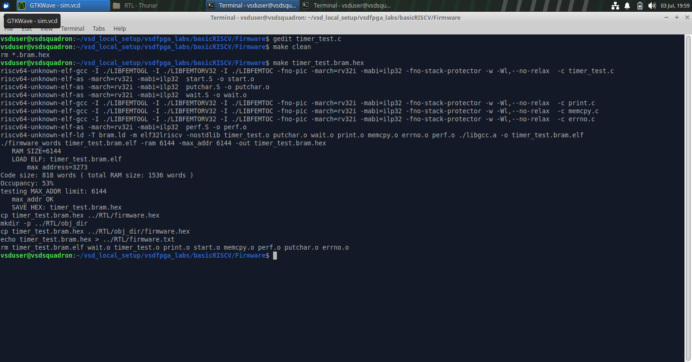
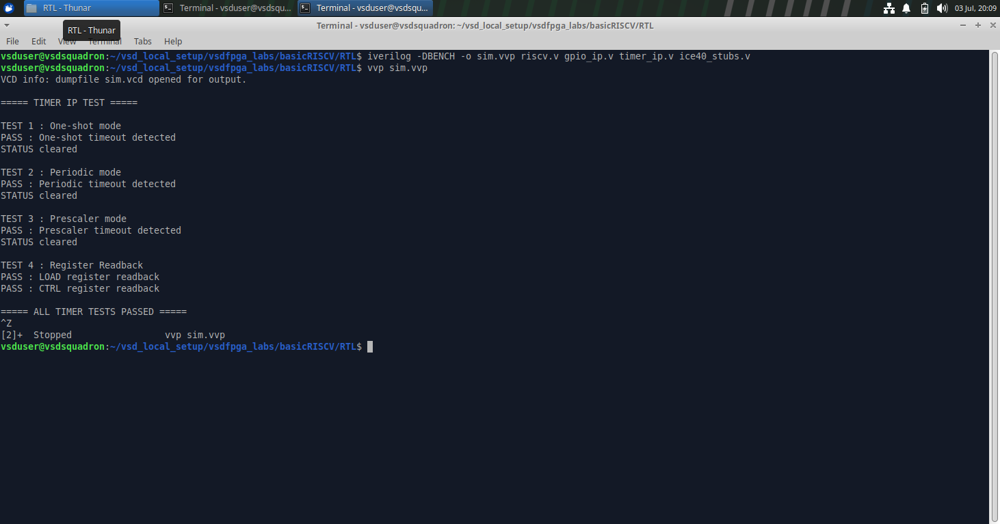
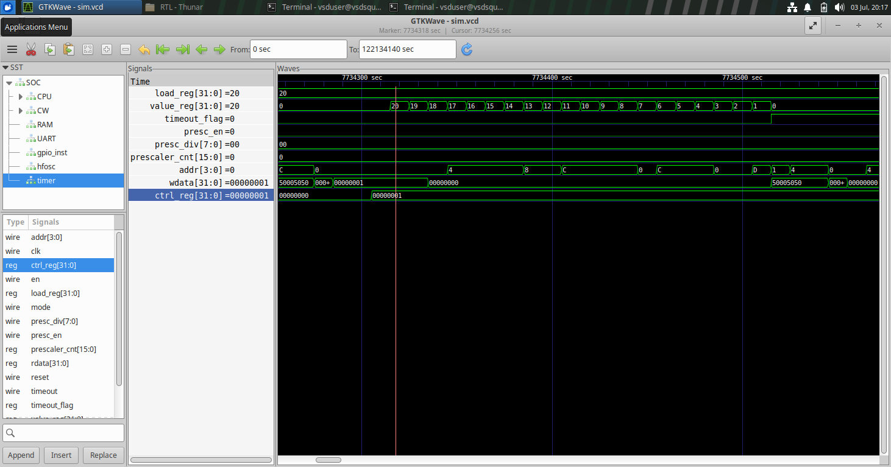
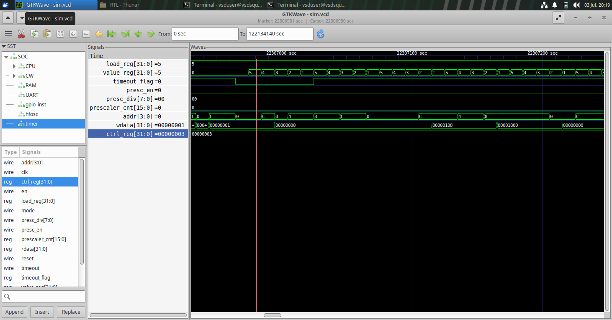
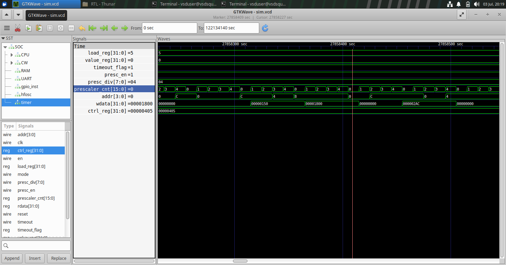
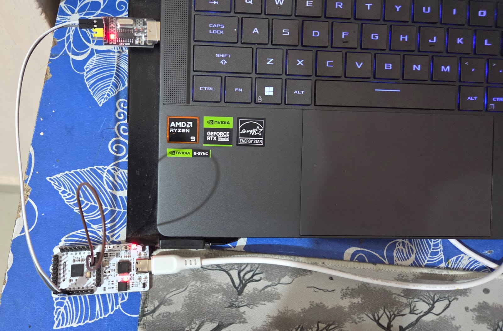
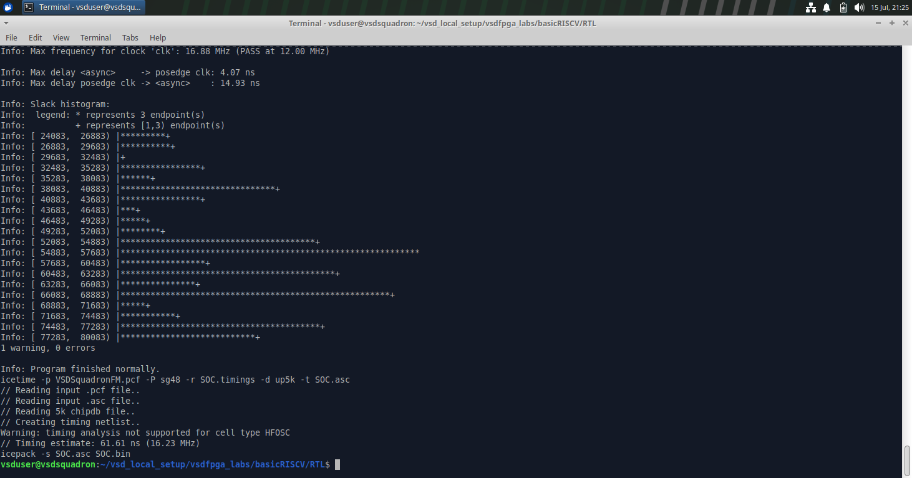
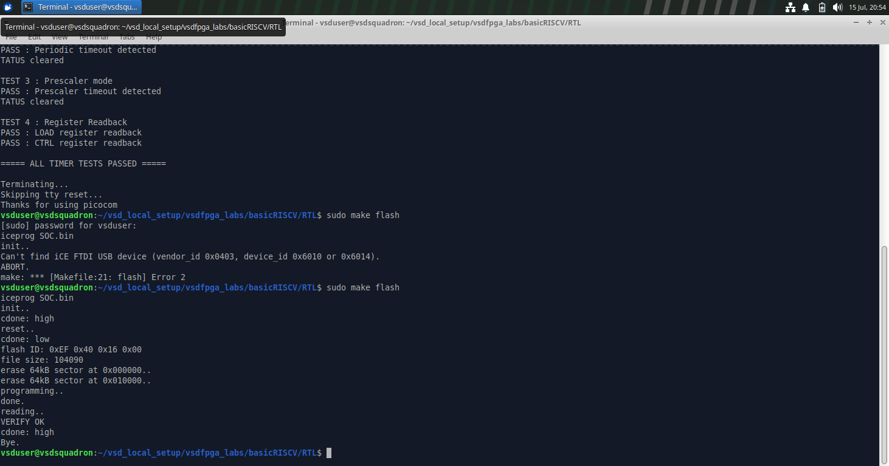
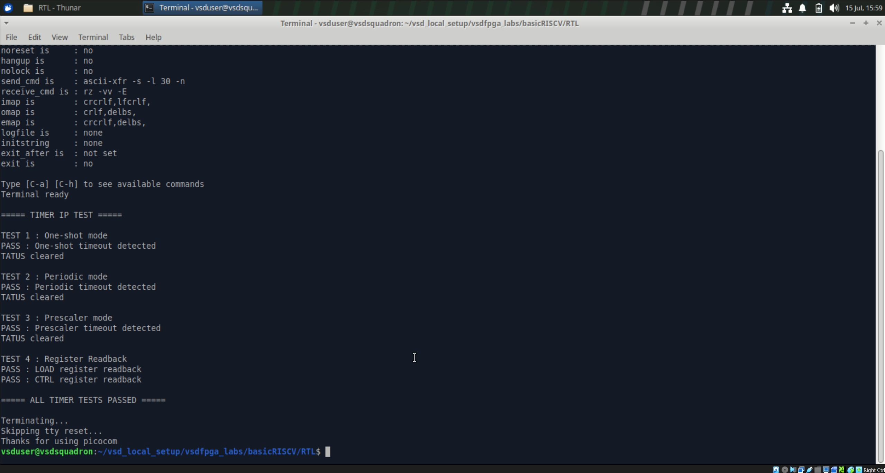

# Timer IP Development for RISC-V SoC (Core Contributor Task)

## 1. Objective

The objective of this project is to design and integrate a configurable Timer peripheral that can be accessed through memory-mapped registers.

The project includes:

- RTL implementation of the Timer IP
- Integration into the existing RISC-V SoC
- Memory-mapped register interface
- Software validation using C firmware
- Functional simulation
- Hardware validation on the VSDSquadron FPGA Mini Board

---

## 2. Relevant Files Used

```text
basicRISCV/
│
├── RTL/
│   ├── riscv.v               ← SoC top-level modified for Timer IP integration
│   ├── timer_ip.v            ← Custom Timer peripheral implementation
│   ├── clockworks.v          ← Clock generation and reset circuitry
│   ├── emitter_uart.v        ← UART transmitter for firmware output
│   ├── Makefile              ← Build, synthesis and FPGA programming
│   ├── ice40_stubs.v         ← Simulation stubs for FPGA primitives
│   └── sim.vvp               ← Compiled simulation executable
│
└── Firmware/
    ├── timer_test.c          ← Firmware used to validate the Timer IP
    ├── io.h                  ← Memory-mapped register definitions
    └── timer_test.bram.hex   ← Generated firmware image loaded into memory
```

## File Description

- **`riscv.v`** : Top-level RISC-V SoC design responsible for integrating the CPU, memory, UART, GPIO, and the newly developed Timer IP.

- **`timer_ip.v`** : Custom Timer peripheral implementing a 32-bit programmable countdown timer with one-shot mode, periodic mode, programmable prescaler, and timeout status generation.

- **`clockworks.v`** : Generates the system clock and reset signals required for reliable FPGA operation.

- **`emitter_uart.v`** : UART transmitter module used by the firmware to print validation results to the serial terminal.

- **`Makefile`** : Build automation file used for firmware compilation, RTL synthesis, place-and-route, bitstream generation, simulation, and FPGA programming.

- **`io.h`** : Firmware header file containing the memory-mapped register definitions and peripheral address mapping used by the Timer firmware.

- **`timer_test.c`** : Firmware application developed to verify all Timer IP functionalities, including one-shot mode, periodic mode, prescaler operation, and register readback.

- **`ice40_stubs.v`** : Simulation support module that replaces FPGA-specific primitives during RTL simulation using Icarus Verilog.

- **`timer_test.bram.hex`** : Memory initialization file generated from the Timer firmware and loaded into the SoC instruction memory for simulation and hardware execution.

- **`sim.vvp`** : Compiled Icarus Verilog simulation executable used to perform RTL verification.

---

## 3. Features

- 32-bit programmable countdown timer
- Memory-mapped register interface
- One-shot mode
- Periodic (auto-reload) mode
- Programmable prescaler
- Current timer value readback
- Timeout status flag
- Write-1-to-clear timeout flag
- Integrated with RISC-V SoC
- Validated in simulation and on FPGA hardware

---

## 4. Project Architecture

                 +----------------------+
                 |     RISC-V CPU       |
                 +----------+-----------+
                            |
                  Memory Mapped Bus
                            |
                +-----------+-----------+
                |        Timer IP       |
                +-----------------------+
                | CTRL Register         |
                | LOAD Register         |
                | VALUE Register        |
                | STATUS Register       |
                +-----------------------+
                            |
                     Timeout Signal

---

## 5. Register Map

| Offset | Register | Access | Description |
|--------:|----------|:------:|-------------|
| 0x00 | CTRL | R/W | Timer control register |
| 0x04 | LOAD | R/W | Initial countdown value |
| 0x08 | VALUE | R | Current timer value |
| 0x0C | STATUS | R/W | Timeout status register |

---

## 6. RTL Design

The Timer IP is implemented as a custom memory-mapped peripheral in Verilog HDL. It interfaces with the RISC-V processor through the SoC bus and provides programmable timing functionality through four memory-mapped registers.

The design consists of the following functional blocks:

- **Control Register** – Configures timer operation, including enable, operating mode (one-shot or periodic), and prescaler settings.
- **Load Register** – Stores the initial countdown value loaded into the timer.
- **Counter Register** – Maintains the current countdown value and decrements on every clock cycle or prescaled clock event.
- **Status Register** – Indicates timeout events and supports Write-1-to-Clear (W1C) functionality.

### Timer Operation

When the timer is enabled, the countdown register is loaded with the value stored in the **LOAD** register. The timer then decrements until it reaches zero.

The operating mode determines the behavior after a timeout:

- **One-Shot Mode:** The timer stops after generating a timeout event.
- **Periodic Mode:** The timer automatically reloads the LOAD value and continues counting.

An optional programmable prescaler divides the input clock before decrementing the timer, allowing longer timing intervals without modifying the system clock frequency.

### Memory-Mapped Interface

The Timer IP is accessed through the SoC's memory-mapped I/O region. Read and write operations are decoded using the lower address bits to access the appropriate register.

The interface supports:

- Register read operations
- Register write operations
- Timer configuration
- Status monitoring
- Timeout flag clearing

### Timeout Generation

When the counter reaches zero, the Timer IP:

1. Sets the timeout status flag.
2. Generates the timeout signal.
3. Either stops counting (One-Shot Mode) or automatically reloads the LOAD register (Periodic Mode).

This implementation allows software to accurately detect timer expiration while maintaining low hardware complexity.

### Design Highlights

- Fully synchronous design
- 32-bit programmable countdown timer
- One-shot and periodic operating modes
- Programmable clock prescaler
- Write-1-to-Clear status register
- Memory-mapped register interface
- Seamless integration with the custom RISC-V SoC

---

## 7. SoC Integration

The Timer IP was integrated into the existing RISC-V SoC by extending the memory-mapped peripheral interface. The integration required modifications to both the hardware design and the firmware to enable software-controlled timer operation.

### Hardware Integration

The following modifications were made to the SoC top-level (`riscv.v`):

- Included the `timer_ip.v` module in the RTL project.
- Instantiated the Timer IP within the SoC.
- Assigned a dedicated memory-mapped I/O address (`IO_TIMER_bit`) for Timer register access.
- Generated the Timer write-enable (`timer_we`) signal using the existing address decoding logic.
- Connected the Timer read data to the SoC I/O read-data multiplexer.
- Connected the Timer timeout output for future interrupt/event expansion.

### Firmware Integration

The firmware support files were updated to communicate with the Timer peripheral through memory-mapped registers.

The following changes were made:

- Added Timer register definitions in `io.h`.
- Defined register offsets for **CTRL**, **LOAD**, **VALUE**, and **STATUS** registers.
- Developed `timer_test.c` to validate all Timer features through software.
- Used UART (`printf`) to display test progress and validation results on the serial terminal.

### Build System Updates

The project build flow was updated to automatically generate the firmware image and include it during FPGA synthesis.

The complete build process consists of:

1. Compiling the firmware using the RISC-V GCC toolchain.
2. Generating the `.bram.hex` memory initialization file.
3. Synthesizing the complete SoC using Yosys.
4. Performing place-and-route using nextpnr-ice40.
5. Generating the FPGA bitstream.
6. Programming the VSDSquadron FPGA Mini using IceStorm (`iceprog`).

### Verification Flow

After integration, the complete system was verified using the following workflow:

- Functional RTL simulation using Icarus Verilog and GTKWave.
- Firmware execution on the simulated RISC-V processor.
- Hardware implementation on the VSDSquadron FPGA Mini.
- UART-based verification using a CH340 USB-to-UART converter.
- Functional validation of all Timer operating modes.

---

## 8. Firmware Development & Validation

To verify the functionality of the Timer IP, a dedicated firmware application (`timer_test.c`) was developed and executed on the RISC-V processor. The firmware communicates with the Timer IP through its memory-mapped registers and validates each feature individually.

The test program performs four independent functional tests covering all major capabilities of the Timer IP.

---

### Test 1: One-Shot Mode

The first test verifies the Timer operating in **One-Shot Mode**.

The firmware performs the following sequence:

1. Load the countdown value into the **LOAD** register.
2. Enable the Timer in One-Shot mode.
3. Continuously poll the **STATUS** register.
4. Detect the timeout event.
5. Clear the timeout flag using the Write-1-to-Clear mechanism.

**Expected Result**

- Timer counts down once.
- Timeout flag is asserted.
- Timer stops after reaching zero.
- STATUS flag is successfully cleared.

---

### Test 2: Periodic Mode

The second test validates the **Periodic (Auto-Reload) Mode**.

The firmware:

1. Programs a smaller countdown value.
2. Enables Periodic mode.
3. Waits until the timeout flag is asserted.
4. Clears the timeout flag.

**Expected Result**

- Timer reloads automatically after reaching zero.
- Countdown restarts without software intervention.
- Timeout event is generated correctly.

---

### Test 3: Prescaler Operation

The third test verifies the programmable prescaler.

The firmware:

1. Loads the countdown value.
2. Enables the prescaler.
3. Configures the prescaler division factor.
4. Starts the Timer.
5. Waits for the timeout event.

**Expected Result**

- Timer decrements according to the configured prescaler.
- Timeout occurs after the expected delay.
- Prescaler logic functions correctly.

---

### Test 4: Register Readback

The final test validates register accessibility.

The firmware writes known values to the Timer registers and immediately reads them back.

Registers Verified:

- LOAD Register
- CTRL Register

**Expected Result**

- Register values are read correctly.
- Memory-mapped interface operates as expected.

---

### UART Output

The firmware reports the result of each test through the UART interface.

Example output:

```text
===== TIMER IP TEST =====

TEST 1 : One-shot mode
PASS : One-shot timeout detected
STATUS cleared

TEST 2 : Periodic mode
PASS : Periodic timeout detected
STATUS cleared

TEST 3 : Prescaler mode
PASS : Prescaler timeout detected
STATUS cleared

TEST 4 : Register Readback
PASS : LOAD register readback
PASS : CTRL register readback

===== ALL TIMER TESTS PASSED =====
```

The firmware was compiled using the RISC-V GCC toolchain to generate the BRAM initialization file.

```bash
make clean
make timer_test.bram.hex
```



---

## 9. Simulation Results

Before deploying the Timer IP on the FPGA, the complete design was functionally verified using **Icarus Verilog** and **GTKWave**. The simulation ensured that the Timer operated correctly under different configurations and that the software communicated with the peripheral through the memory-mapped interface as expected.

### Simulation Environment

The following open-source tools were used for simulation:

- **Icarus Verilog** – RTL compilation and simulation
- **GTKWave** – Waveform visualization and analysis

The simulation verified both the Timer IP functionality and its integration with the RISC-V SoC.

### Functional Verification

The following Timer functionalities were verified:

- Correct loading of the countdown value
- Countdown operation
- One-shot mode
- Periodic auto-reload mode
- Prescaler operation
- Timeout flag generation
- Register read and write operations

### RTL Simulation

The complete SoC, including the integrated Timer IP, was verified using Icarus Verilog. The simulation executed the Timer firmware and successfully passed all functional tests.

```bash
iverilog -DBENCH -o sim.vvp riscv.v gpio_ip.v timer_ip.v ice40_stubs.v
vvp sim.vvp
```



### Waveform Analysis

The GTKWave waveform confirms the following sequence of operations:

1. The firmware writes the initial countdown value into the **LOAD** register.
2. The Timer is enabled through the **CTRL** register.
3. The countdown value decreases according to the configured clock or prescaler.
4. When the counter reaches zero, the **TIMEOUT** flag is asserted.
5. In **Periodic Mode**, the counter automatically reloads the programmed value.
6. In **One-Shot Mode**, the Timer stops after generating the timeout event.

### One-Shot Mode Verification

The waveform below shows the Timer operating in **One-Shot Mode**.

The countdown register is initialized with a value of **20** and decrements every clock cycle until it reaches zero. Once the counter expires, the **timeout flag** is asserted and the timer stops counting, demonstrating correct one-shot behavior.



### Periodic Mode Verification

The following waveform demonstrates **Periodic Mode** operation.

The Timer is loaded with a countdown value of **5**. After reaching zero, the counter automatically reloads the programmed value and resumes counting without software intervention, confirming the correct implementation of the auto-reload mechanism.



### Prescaler Verification

The waveform below verifies the operation of the programmable prescaler.

The prescaler is enabled with a division factor of **4**, causing the Timer counter to decrement only after the prescaler completes its programmed count. This confirms that the Timer correctly supports configurable clock division for extended timing intervals.



---

## 10. Hardware Implementation & Validation

After successful functional verification through simulation, the complete RISC-V SoC incorporating the Timer IP was synthesized and deployed on the **VSDSquadron FPGA Mini Board** for real hardware validation.

The FPGA bitstream was generated using the open-source FPGA toolchain and programmed onto the board using **IceStorm** utilities.

### Hardware Platform

- **Development Board:** VSDSquadron FPGA Mini
- **FPGA:** Lattice iCE40UP5K
- **Clock Frequency:** 12 MHz Internal HFOSC
- **Programming Tool:** IceProg
- **UART Interface:** CH340 USB-to-UART Converter


---

### Hardware Connections

The UART output generated by the RISC-V processor was monitored using an external CH340 USB-to-UART converter.

Hardware connections used during validation:

| CH340 Module | FPGA Board |
|--------------|------------|
| TX | RX (Pin 3) |
| RX | TX (Pin 4) |
|  | Pin 23 ↔ GND(Common Ground) |
| VCC ↔ 3.3V | Jumper Installed |



---

### Build Process

After implementing the Timer IP and integrating it into the RISC-V SoC, the complete design was built using the provided Makefile.

The build process performs the following operations:

1. Compiles the Timer firmware using the RISC-V GCC toolchain.
2. Generates the `.bram.hex` memory initialization file.
3. Synthesizes the complete SoC using Yosys.
4. Performs place-and-route using nextpnr-ice40.
5. Generates the FPGA bitstream (`SOC.bin`).

The complete build was executed using:

```bash
make build
```



---

### FPGA Programming

The firmware was first compiled into a BRAM initialization file and integrated into the FPGA design during synthesis.

The FPGA was programmed using:

```bash
sudo make flash
```

After successful programming, a serial terminal was opened to observe the UART output generated by the firmware.



---

### Hardware Validation Results

The Timer IP was validated on the FPGA by executing the Timer firmware on the embedded RISC-V processor.

The firmware successfully verified:

- One-Shot Mode
- Periodic Mode
- Prescaler Operation
- Register Readback

The picocom terminal was opened using using:

```bash
make terminal
```

The UART terminal displayed the successful completion of all validation tests.



The successful execution of the firmware confirms the correct hardware implementation of the Timer IP and its seamless integration into the RISC-V SoC.

---

## 11. Observations

- The Timer IP was successfully integrated into the VSDSquadron RISC-V SoC using a memory-mapped I/O interface.
- Firmware successfully configured the Timer through the CTRL and LOAD registers.
- The Timer correctly generated timeout events in both One-Shot and Periodic operating modes.
- The programmable prescaler functioned as expected, allowing adjustable timer intervals.
- Register readback verified correct operation of the memory-mapped interface.
- RTL simulation using Icarus Verilog confirmed correct Timer behavior before FPGA deployment.
- GTKWave analysis verified countdown operation, timeout generation, register transactions, and periodic reload functionality.
- Hardware validation on the VSDSquadron FPGA Mini confirmed successful end-to-end operation of the Timer IP using UART output.

---

## 12. Key Learnings

- Learned how to design a custom memory-mapped peripheral using Verilog HDL.
- Gained practical experience integrating a hardware IP into an existing RISC-V SoC.
- Understood the implementation of memory-mapped register interfaces for processor communication.
- Learned how firmware interacts with hardware peripherals through dedicated register addresses.
- Gained experience implementing configurable Timer features such as One-Shot mode, Periodic mode, and programmable prescalers.
- Improved understanding of RTL verification using Icarus Verilog and waveform analysis with GTKWave.
- Learned the complete FPGA implementation flow, including synthesis, place-and-route, bitstream generation, and hardware programming.
- Successfully validated hardware functionality using UART communication through a CH340 USB-to-UART converter.

---

## 12. Conclusion

This project successfully demonstrated the complete design, integration, verification, and hardware validation of a custom **32-bit Timer IP** for a RISC-V based System-on-Chip. The Timer peripheral was implemented in Verilog HDL, integrated into the existing memory-mapped I/O architecture, and controlled through firmware executing on the embedded RISC-V processor.

Comprehensive verification was carried out using RTL simulation with Icarus Verilog and GTKWave, followed by successful deployment on the VSDSquadron FPGA Mini. Hardware testing confirmed correct operation of One-Shot mode, Periodic mode, programmable prescaler functionality, register readback, and UART-based result reporting.

The project provided valuable hands-on experience in digital hardware design, SoC peripheral integration, firmware development, RTL verification, FPGA implementation, and hardware-software co-design using an open-source FPGA development flow.

---
